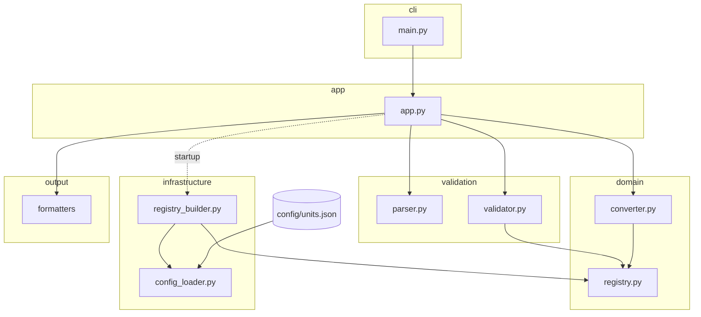
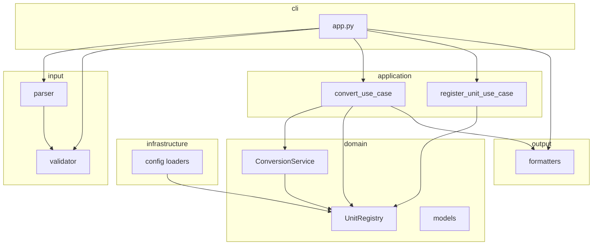

# Unit Converter — SPEC Phase Session Transcript

| Field | Value |
|-------|-------|
| Phase | **SPEC** (Activity 1 — 문제 코드·요구사항 분석) |
| Project | UnitConverter_19 |
| Session ID | `d3525f85-fdd4-429e-bc88-98947119fdd7` |
| Exported | 2026-06-05 |
| Source | agent-transcripts/d3525f85-fdd4-429e-bc88-98947119fdd7/d3525f85-fdd4-429e-bc88-98947119fdd7.jsonl |
| Spec 산출물 | [Report/01.UnitConverter_Spec_Report.md](../Report/01.UnitConverter_Spec_Report.md), [docs/PRD.md](../docs/PRD.md), [.cursorrules](../.cursorrules) |
| Related | [README.md](../README.md) |

> Tool-only assistant steps and redacted content are omitted from this readable export.
> Raw JSONL: [01_SPEC_UnitConverter_Transcript.jsonl](./01_SPEC_UnitConverter_Transcript.jsonl)

---

## Turn 1 — User

@README.md @UnitConverter.py 레거시 코드 스멜과 PRD 갭을 목록으로 정리해줘.


---

## Turn 1 — Assistant

README와 UnitConverter.py, PRD 관련 문서를 읽고 레거시 코드 스멜과 요구사항 갭을 정리합니다.

[REDACTED]


**Tools used:** Read(path='c:\\DEV\\UnitConverter_19\\README.md'); Read(path='c:\\DEV\\UnitConverter_19\\UnitConverter.py'); Glob(glob_pattern='**/*PRD*'); Glob(glob_pattern='**/*.{md,txt}')


---

## Turn 1 — Assistant

**Tools used:** Glob(glob_pattern='**/*'); Grep(pattern='test|pytest|unittest', glob='*', -i=True)


---

## Turn 1 — Assistant

프로젝트에는 별도 PRD 파일이 없고, `README.md`의 **기본/품질/추가 요구사항**이 사실상 PRD 역할을 합니다. 현재 코드는 `UnitConverter.py` 단일 파일(37줄)뿐이며 테스트·설정 파일도 없습니다.

---

## 레거시 코드 스멜 (Legacy Code Smells)

### 구조·설계

| # | 스멜 | 현재 상태 |
|---|------|-----------|
| 1 | **God Function** | `main()` 하나가 입력 파싱, 검증, 변환, 출력을 모두 처리 |
| 2 | **OCP 위반** | 단위 추가 시 `elif` 분기(16–24행)와 출력(30–32행)을 동시에 수정해야 함 |
| 3 | **SRP 위반** | README가 요구하는 “클래스 단위 책임 분리” 없음 — 클래스/인터페이스 자체가 없음 |
| 4 | **Magic Number** | `3.28084`, `1.09361`이 코드에 직접 박혀 있음 |
| 5 | **중복 로직** | 입력→meter 변환과 meter→다른 단위 변환이 별도 블록으로 반복 |
| 6 | **Primitive Obsession** | `unit`(str), `value`(float)만 사용 — `Unit`, `ConversionResult` 같은 도메인 모델 없음 |
| 7 | **하드코딩된 단위 목록** | `"meter"`, `"feet"`, `"yard"` 문자열이 여러 곳에 분산 |
| 8 | **테스트 불가 구조** | `input()`/`print()`와 비즈니스 로직이 결합 — 단위 테스트하기 어려움 |

### 입력·출력

| # | 스멜 | 현재 상태 |
|---|------|-----------|
| 9 | **불완전한 입력 검증** | README는 음수 검증을 명시했으나 `value < 0` 체크 없음 |
| 10 | **입력 정규화 부재** | `" meter:2.5 "`처럼 공백 포함 입력 처리 없음 |
| 11 | **출력 포맷 고정** | `print()`만 사용 — JSON/CSV/표 등 선택 불가 |
| 12 | **출력 정밀도 불일치** | README 예시는 `8.2 feet`, `2.7 yard`(반올림)인데 코드는 전체 float 출력 |

### 확장성·운영

| # | 스멜 | 현재 상태 |
|---|------|-----------|
| 13 | **설정 내부화** | 변환 비율이 코드에 고정 — 외부 설정(JSON/YAML) 없음 |
| 14 | **동적 등록 불가** | 런타임에 `1 cubit = 0.4572 meter` 같은 단위 추가 불가 |
| 15 | **테스트 코드 부재** | README가 요구하는 TC 전무 (`tests/`, `pytest` 등 없음) |

### 코드 위치 참고

```1:36:c:\DEV\UnitConverter_19\UnitConverter.py
def main():
    input_str = input("Insert value for converting (ex: meter:2.5): ")
    # ... parsing, validation, conversion, output all in one function ...
    if unit == "meter":
        meter_value = value
    elif unit == "feet":
        meter_value = value / 3.28084
    elif unit == "yard":
        meter_value = value / 1.09361
    # ...
    print(f"{value} {unit} = {in_meters} meter")
    print(f"{value} {unit} = {in_feet} feet")
    print(f"{value} {unit} = {in_yards} yard")
```

---

## PRD 갭 (README 요구사항 대비 미구현/불일치)

### 기본 요구사항

| 요구사항 | PRD (README) | 현재 구현 | 갭 |
|----------|--------------|-----------|-----|
| `단위:값` 입력 변환 | `meter:2.5` → 모든 단위 출력 | 3단위 변환 동작 | **부분 충족** — 핵심 흐름은 동작 |
| 지원 단위 | meter, feet, yard | 3단위 하드코딩 | **충족** |
| 확장 시 코드 변경 최소화 | OCP 기반 설계 | 단위마다 `elif` + `print` 추가 | **미충족** |
| 단위 변환 TC | 각 변환 정확성 검증 | 테스트 파일 없음 | **미충족** |

### 비즈니스 로직

| 요구사항 | PRD | 현재 | 갭 |
|----------|-----|------|-----|
| `1 meter = 3.28084 feet` | 명시 | 하드코딩 사용 | **값은 일치**, **설정 외부화는 미구현** |
| `1 meter = 1.09361 yard` | 명시 | 하드코딩 사용 | 동일 |
| feet/yard 비율은 meter 기준 | meter 허브 변환 | meter 경유 계산 | **로직은 충족** |
| 출력 예시 포맷 | `2.5 meter = 8.2 feet` | 전체 소수 출력 | **표시 형식 불일치** (반올림/자릿수 미정의) |

### 품질 요구사항

| 요구사항 | PRD | 현재 | 갭 |
|----------|-----|------|-----|
| OCP | 인터페이스/확장 가능 설계 | 절차적 스크립트 | **미충족** |
| SRP | 클래스별 단일 책임 | 단일 함수 | **미충족** |
| 입력 검증 — 잘못된 형식 | `:` 없으면 거부 | `':' not in input_str` 처리 | **부분 충족** |
| 입력 검증 — 음수 | 명시 | 검사 없음 | **미충족** |
| 입력 검증 — 없는 단위 | 명시 | `Unknown unit` 출력 | **충족** |

### 추가 요구사항 (Activities 4단계 목표)

| # | 요구사항 | PRD | 현재 | 갭 |
|---|----------|-----|------|-----|
| 1 | **설정 외부화** | JSON/YAML에서 비율 로드 | 코드 내 상수 | **전면 미구현** |
| 2 | **동적 단위 등록** | `1 cubit = 0.4572 meter` 입력 등록 | 고정 3단위만 | **전면 미구현** |
| 3 | **출력 포맷 선택** | JSON / CSV / 표 | `print`만 | **전면 미구현** |

### Activities 일정 대비 달성도 (README 67–83행)

| Activity | 목표 | 현재 |
|----------|------|------|
| 1. 코드·요구사항 분석 | 구조 이해 | 시작점 수준 (분석용 레거시) |
| 2. 기본·품질 요구 구현 | OCP/SRP/검증 | **미착수** |
| 3. TC 구현 | 변환·검증 테스트 | **미착수** |
| 4. 추가 요구 3종 + TC | 설정/동적등록/출력포맷 | **미착수** |
| 5. 회고·발표 | — | 구현 완료 후 가능 |

---

## 요약

**레거시 스멜 핵심:** 단일 함수·매직 넘버·단위 하드코딩·I/O 결합·테스트/설정/확장 구조 부재.

**PRD 갭 핵심:** README의 “품질 요구(OCP/SRP/음수 검증)”와 “추가 요구(설정 외부화, 동적 등록, 출력 포맷)”가 거의 전부 미구현. 기본 변환 3단위만 동작하는 **초기 스켈레톤** 상태입니다.

원하시면 Agent 모드에서 OCP/SRP 기준 리팩터링 순서나 테스트·설정 파일 구조 제안까지 이어서 정리할 수 있습니다.

[REDACTED]


---

## Turn 2 — User

@UnitConverter.py 레거시 코드에서 SRP(단일 책임 원칙) 위반 사항과 입력 검증(음수, 잘못된 형식) 누락 부분을 찾아 분석해줘.


---

## Turn 2 — Assistant

**Tools used:** Read(path='c:\\DEV\\UnitConverter_19\\UnitConverter.py'); Read(path='c:\\DEV\\UnitConverter_19\\README.md', offset=27, limit=30)


---

## Turn 2 — Assistant

`UnitConverter.py`는 `main()` 하나에 모든 로직이 모여 있어, README가 요구하는 **SRP(클래스 단위 책임 분리)** 와 **입력 검증(음수·형식)** 과의 갭이 명확합니다.

---

## 1. SRP(단일 책임 원칙) 위반 분석

SRP는 “한 모듈/클래스는 **변경 이유가 하나**”여야 한다는 원칙입니다. README 55행은 이를 **“SRP를 만족하는 클래스 구성”** 으로 구체화합니다. 현재 코드는 클래스도 없고, `main()`이 아래 책임을 **한 함수에 섞어** 두었습니다.

### 1.1 `main()`에 묶인 책임들

| 책임 | 코드 위치 | 변경을 유발하는 이유 |
|------|-----------|----------------------|
| **사용자 I/O** | 2행 `input()`, 30–32행 `print()` | UI/프롬프트·출력 형식 변경 |
| **입력 파싱** | 8행 `split(':', 1)` | 입력 형식 변경 (`meter:2.5` → 다른 구분자 등) |
| **형식·값 검증** | 4–6, 10–14, 22–24행 | 검증 규칙 추가(음수, 공백 등) |
| **단위 식별·허용 목록** | 16–24행 `if/elif` | 지원 단위 추가/삭제 |
| **변환 계산** | 16–28행 | 변환 비율·알고리즘 변경 |
| **결과 포맷팅** | 30–32행 f-string | 소수 자릿수, JSON/CSV 등 출력 변경 |

하나의 함수가 **6가지 이상의 변경 이유**를 가지므로 SRP 위반입니다.

### 1.2 구체적 위반 지점

**① I/O와 도메인 로직 결합**

```1:2:c:\DEV\UnitConverter_19\UnitConverter.py
def main():
    input_str = input("Insert value for converting (ex: meter:2.5): ")
```

입력 수집이 변환 로직과 같은 함수에 있어, 변환만 단위 테스트하려면 `input()`/`print()`를 우회해야 합니다.

**② 파싱·검증·변환이 한 흐름**

```4:24:c:\DEV\UnitConverter_19\UnitConverter.py
    if ':' not in input_str:
        print("Invalid format. Use unit:value (ex: meter:2.5)")
        return

    unit, value_str = input_str.split(':', 1)
    # ... float 변환, unit 분기 ...
    else:
        print(f"Unknown unit: {unit}")
        return
```

- **파싱**: `:` 분리, `unit`/`value_str` 추출  
- **검증**: 형식, 숫자, 단위 존재  
- **변환**: meter 기준 환산  

각각 독립 클래스/함수로 분리 가능한데 한 블록에 섞여 있습니다.

**③ 변환 로직과 출력 로직 결합**

```26:32:c:\DEV\UnitConverter_19\UnitConverter.py
    in_meters = meter_value
    in_feet = meter_value * 3.28084
    in_yards = meter_value * 1.09361

    print(f"{value} {unit} = {in_meters} meter")
    print(f"{value} {unit} = {in_feet} feet")
    print(f"{value} {unit} = {in_yards} yard")
```

계산 결과(`in_meters` 등)와 **표현 방식**(문자열 조합, 줄 수)이 붙어 있습니다. README 추가 요구의 JSON/CSV/표 출력을 넣으려면 `main()` 전체를 건드리게 됩니다.

**④ 단위 레지스트리·변환·출력 대상이 하드코딩**

- 입력 단위 판별: 16–21행 `elif` 3개  
- 출력 대상: 30–32행 `print` 3줄  

단위가 하나 늘면 **파싱 이후 분기**와 **출력**을 동시에 수정해야 해, “단위 추가”라는 변경 이유가 여러 책임 영역에 퍼집니다. (OCP와도 연결되는 SRP 위반)

### 1.3 README 기대 구조 vs 현재

| README 기대 | 현재 |
|-------------|------|
| 클래스별 단일 책임 (파서, 검증기, 변환기, 포맷터 등) | `main()` 단일 함수 |
| 변환 비율·단위는 설정/등록 쪽 책임 | `3.28084` 등이 `main()` 내부 상수 |
| 출력 포맷은 별 책임 | `print`가 `main()`에 직접 존재 |

**정리:** SRP 위반의 핵심은 “기능이 많다”가 아니라 **`main()`이 변경 이유를 여러 개 가진 책임의 경계가 없다**는 점입니다.

---

## 2. 입력 검증 누락 분석

README 56행: **입력 값 검증 (음수, 잘못된 형식, 없는 단위)**. 현재는 **일부만** 구현되어 있습니다.

### 2.1 구현된 검증

| 항목 | 구현 | 코드 |
|------|------|------|
| `:` 없음 | ✅ | 4–6행 |
| 숫자 아님 | ✅ | 10–14행 `ValueError` |
| 없는 단위 | ✅ | 22–24행 `Unknown unit` |

### 2.2 누락: 음수 검증

README가 명시한 **음수** 검사가 없습니다.

```10:14:c:\DEV\UnitConverter_19\UnitConverter.py
    try:
        value = float(value_str)
    except ValueError:
        print(f"Invalid number: {value_str}")
        return
```

`float()`는 `-2.5`를 정상 파싱하므로, `meter:-2.5`는 그대로 변환·출력됩니다.

- `meter:-2.5` → 음수 meter/feet/yard 출력 (거부 없음)
- PRD와 불일치: 길이는 보통 0 이상으로 가정하는 경우가 많음

**누락 위치:** 14행 `return` 직후, 변환 분기(16행) **이전**에 `value < 0` 검사가 있어야 합니다.

### 2.3 누락·불완전: 잘못된 형식

`':' not in input_str`만으로는 “잘못된 형식”을 충분히 막지 못합니다.

| 입력 예시 | 현재 동작 | 문제 |
|-----------|-----------|------|
| `meter:2.5` | 정상 | — |
| `meter2.5` (콜론 없음) | 4–6행에서 거부 | ✅ |
| `meter:` | `float('')` → `ValueError` | ✅ (간접 처리) |
| `:2.5` | `unit==""` → `Unknown unit: ` | ⚠️ “형식 오류”가 아니라 “없는 단위” |
| `meter:2.5:extra` | `split(':',1)` → value `2.5:extra` → `Invalid number` | ✅ |
| ` meter:2.5 ` | 공백 포함 unit → `Unknown unit:  meter` | ⚠️ trim 없음 |
| `meter: 2.5` | `float(' 2.5')` → 정상 | ✅ (우연히 동작) |
| `meter:abc` | `Invalid number` | ✅ |
| `meter:-0` | `-0.0` 출력 | ⚠️ 음수/0 경계 미정의 |
| 빈 문자열 `""` | `Invalid format` (`:` 없음) | ✅ |
| `::2.5` | unit `""` → Unknown unit | ⚠️ 형식 vs 단위 메시지 혼동 |

**형식 검증의 구조적 한계**

1. **`unit` 비어 있음** — `:2.5`, `::1` 등은 “형식 오류”보다 “Unknown unit”으로 처리됨.  
2. **공백 정규화 없음** — `strip()` 없어 `" meter"` 같은 입력이 단위 오류로만 처리됨.  
3. **다중 콜론/빈 value** — `meter:`는 숫자 오류로만 처리; “unit만 있고 value 없음”을 형식 오류로 명시하지 않음.  
4. **음수·0** — 음수는 허용; 0은 허용(명시적 정책 없음).

README의 “잘못된 형식”은 **`unit:value` 한 쌍의 유효성** 전체를 의미하는데, 현재는 **콜론 존재 + float 변환** 수준입니다.

### 2.3 검증 책임이 SRP와 겹치는 부분

검증 로직이 `main()` 안에 흩어져 있어:

- 형식 규칙 추가(음수, trim, 빈 unit) 시 **변환·출력 코드와 같은 함수**를 수정해야 하고  
- 검증만 테스트하려면 **전체 `main()` 또는 I/O 모킹**이 필요합니다.

README가 기대하는 “검증 전용 책임”과도 맞지 않습니다.

---

## 3. 종합

| 구분 | 상태 | 요약 |
|------|------|------|
| **SRP** | ❌ 미충족 | `main()`이 I/O, 파싱, 검증, 변환, 포맷팅, 단위 목록을 모두 담당 |
| **음수 검증** | ❌ 누락 | README 명시 항목 미구현 |
| **잘못된 형식** | ⚠️ 부분 | 콜론·비숫자만; 빈 unit, 공백, 형식/단위 메시지 구분 부족 |
| **없는 단위** | ✅ 구현 | `Unknown unit` 처리 |

리팩터링 방향(참고): `InputParser` / `InputValidator` / `UnitConverter`(도메인) / `OutputFormatter` / `Application`(조합)처럼 책임을 나누고, 검증기에서 **형식·음수·단위**를 한곳에서 정책화하면 README의 SRP·입력 검증 요구와 맞춰갈 수 있습니다. (Ask 모드이므로 코드 변경은 하지 않았습니다. 구현이 필요하면 Agent 모드로 전환해 주세요.)

[REDACTED]


---

## Turn 3 — User

UnitConverter의 OCP/SRP를 만족하는 Python 패키지 구조를 제안하고, PRD의 요구사항(FR/NFR)을 각 레이어에 어떻게 매핑할지 설명해줘.


---

## Turn 3 — Assistant

README의 FR/NFR을 다시 확인한 뒤, OCP/SRP에 맞는 패키지 구조와 레이어별 매핑을 제안합니다.

[REDACTED]


**Tools used:** Read(path='c:\\DEV\\UnitConverter_19\\README.md'); Read(path='c:\\DEV\\UnitConverter_19\\UnitConverter.py')


---

## Turn 3 — Assistant

README를 PRD로 두고, OCP/SRP를 만족하는 패키지 구조와 FR/NFR 레이어 매핑을 정리했습니다.

---

## PRD 요구사항 분류 (FR / NFR)

README에는 FR/NFR 라벨이 없으므로, 구현·테스트에 쓰기 쉽게 아래처럼 나눕니다.

### Functional Requirements (FR)

| ID | 요구사항 | 출처 |
|----|----------|------|
| **FR-01** | `단위:값` 입력을 받아 등록된 모든 단위로 변환해 출력 | 기본 1, Overview |
| **FR-02** | 초기 지원 단위: meter, feet, yard | 기본 2 |
| **FR-03** | meter 허브 기준 변환 (`1m=3.28084ft`, `1m=1.09361yd`, ft↔yd는 meter 경유) | 비즈니스 로직 |
| **FR-04** | 입력 검증: 음수, 잘못된 형식, 없는 단위 | 품질 |
| **FR-05** | 변환 비율을 JSON/YAML 외부 설정에서 로드 | 추가 1 |
| **FR-06** | 런타임 단위 등록 (`1 cubit = 0.4572 meter`) | 추가 2 |
| **FR-07** | 출력 포맷 선택: JSON / CSV / 표(table) | 추가 3 |

### Non-Functional Requirements (NFR)

| ID | 요구사항 | 출처 |
|----|----------|------|
| **NFR-01** | OCP — 단위·포맷·설정 소스 추가 시 기존 코드 수정 최소화 | 기본 3, 품질, 추가 |
| **NFR-02** | SRP — 클래스/모듈별 단일 책임 | 품질 |
| **NFR-03** | 테스트 가능성 — 변환·검증 로직을 I/O 없이 검증 | 기본 4, Activities 3 |
| **NFR-04** | 정확성 — 단위 간 변환 결과가 비율과 일치 | 기본 4, 비즈니스 로직 |

---

## 제안 패키지 구조

실습 규모(단일 CLI, 3단위+α)에 맞춰 **레이어는 얇게**, **확장 지점(Protocol/ABC)은 명확히** 두는 구조입니다.

```text
UnitConverter_19/
├── config/
│   └── units.json                 # FR-05: 기본 비율 외부화
├── unit_converter/
│   ├── __init__.py
│   ├── __main__.py                # python -m unit_converter
│   ├── app.py                     # 유스케이스 조합 (thin orchestrator)
│   │
│   ├── domain/                    # 핵심 도메인 — I/O·포맷·설정 파일 모름
│   │   ├── __init__.py
│   │   ├── models.py              # Quantity, ConversionRow, UnitDefinition
│   │   ├── registry.py            # UnitRegistry (등록·조회)
│   │   ├── converter.py           # LengthConverter (meter 허브 변환)
│   │   └── exceptions.py          # UnknownUnitError, InvalidValueError 등
│   │
│   ├── validation/                # 입력 해석·검증만
│   │   ├── __init__.py
│   │   ├── parser.py              # "meter:2.5", "1 cubit = 0.4572 meter" 파싱
│   │   └── validator.py           # 형식·음수·단위 존재 검증
│   │
│   ├── infrastructure/            # 외부 세계 접근 (설정 파일, persistence)
│   │   ├── __init__.py
│   │   ├── config_loader.py       # ConfigLoader Protocol + Json/Yaml 구현
│   │   └── registry_builder.py    # 설정 → UnitRegistry 빌드
│   │
│   ├── output/                    # 출력 직렬화만 (OCP 확장 지점)
│   │   ├── __init__.py
│   │   ├── base.py                # OutputFormatter Protocol
│   │   ├── table_formatter.py     # FR-07: 표
│   │   ├── json_formatter.py      # FR-07: JSON
│   │   └── csv_formatter.py       # FR-07: CSV
│   │
│   └── cli/                       # 사용자 I/O만
│       ├── __init__.py
│       └── main.py                # input/print, 명령 라우팅
│
├── tests/
│   ├── unit/
│   │   ├── test_converter.py      # FR-03, NFR-04
│   │   ├── test_validator.py      # FR-04
│   │   ├── test_parser.py         # FR-01, FR-06
│   │   ├── test_registry.py       # FR-06, NFR-01
│   │   └── test_formatters.py     # FR-07
│   └── integration/
│       └── test_app.py            # FR-01 end-to-end (포맷ter/loader 주입)
│
├── UnitConverter.py               # 얇은 진입점: cli.main() 호출
├── pyproject.toml                 # (선택) pytest, 패키지 메타
└── README.md
```

### OCP가 드러나는 확장 지점

| 확장 | 수정 없이 추가 | 닫혀 있는(수정 불필요) 코드 |
|------|----------------|----------------------------|
| 새 단위 | `config/units.json` 또는 FR-06 등록 | `converter.py`, `validator.py` |
| 새 출력 포맷 | `output/xml_formatter.py` + Protocol 구현 | `app.py`, `converter.py` |
| 새 설정 형식 | `infrastructure/yaml_loader.py` | `registry_builder`, domain |
| 새 입력 명령 | `parser.py`에 패턴 추가 (파서만) | domain 변환 로직 |

### SRP가 드러나는 책임 경계

| 모듈 | 단일 책임 | 변경 이유 |
|------|-----------|-----------|
| `parser.py` | 문자열 → 구조화된 명령/요청 | 입력 문법 변경 |
| `validator.py` | 요청 유효성 판정 | 검증 규칙 추가(음수 등) |
| `registry.py` | 단위 이름 ↔ meter 비율 보관 | 등록 API 변경 |
| `converter.py` | meter 허브 수학 변환 | 변환 알고리즘 변경 |
| `config_loader.py` | 파일 → dict | JSON/YAML 파서 |
| `output/*.py` | `ConversionResult` → 문자열 | 출력 형식 |
| `cli/main.py` | stdin/stdout 상호작용 | UX 변경 |
| `app.py` | 유스케이스 순서 조합 | 워크플로 변경 |

---

## 레이어별 FR/NFR 매핑

### 1. `cli/` — Presentation Layer

| 매핑 | 역할 |
|------|------|
| **FR-01** (일부) | 사용자 입력 수집, 결과 출력 |
| **FR-07** (일부) | 포맷 선택 옵션 수집 (`--format json` 등) |
| **NFR-02** | I/O만 담당; 변환·검증 로직 없음 |

```text
사용자 → cli.main() → app 실행 → formatter 결과 print
```

---

### 2. `validation/` — Input Layer

| 매핑 | 역할 |
|------|------|
| **FR-01** | `meter:2.5` → `ConvertRequest(unit, value)` |
| **FR-04** | `validator`: 콜론 형식, 빈 unit, 음수, 미등록 단위 |
| **FR-06** | `1 cubit = 0.4572 meter` → `RegisterUnitRequest` 파싱 |
| **NFR-02** | 파싱 vs 검증 분리 (`parser` / `validator`) |
| **NFR-03** | 순수 함수 위주 → 단위 테스트 용이 |

**FR-04 상세 매핑 (`validator.py`)**

- 잘못된 형식 → `InvalidFormatError`
- 음수 → `NegativeValueError`
- 없는 단위 → `UnknownUnitError` (registry 조회)

---

### 3. `domain/` — Core Business Layer

| 매핑 | 역할 |
|------|------|
| **FR-01** | `LengthConverter.convert_all(source)` → 전 단위 결과 |
| **FR-02** | 초기 단위는 `registry`에 로드된 정의로 표현 |
| **FR-03** | meter 허브: `to_meter = value / ratio`, `from_meter = meter * ratio` |
| **FR-06** | `UnitRegistry.register(name, meters_per_unit)` |
| **NFR-01** | 단위 추가 시 `converter`/`validator` 분기 수정 불필요 |
| **NFR-04** | 변환 정확성의 핵심 — 테스트 집중 대상 |

**FR-03 구현 개념 (`converter.py`)**

```python
# 각 단위: "1 unit = X meter" 로 registry에 저장
meter_value = value * unit.to_meter_factor  # 또는 / ratio — 한 가지 규칙으로 통일
for each registered unit:
    result = meter_value / target.to_meter_factor
```

feet/yard 간 비율은 **둘 다 meter 기준**이므로 converter에 ft↔yd 전용 분기가 필요 없습니다 (OCP).

---

### 4. `infrastructure/` — Configuration / Persistence Layer

| 매핑 | 역할 |
|------|------|
| **FR-05** | `JsonConfigLoader` / `YamlConfigLoader` → 비율 dict |
| **FR-02** (초기 데이터) | `config/units.json`에서 meter/feet/yard 로드 |
| **FR-06** (선택) | 등록된 단위를 파일에 persist (PRD 필수는 아니나 실습에 유용) |
| **NFR-01** | `ConfigLoader` Protocol — 새 포맷은 loader만 추가 |

**예시 `config/units.json`**

```json
{
  "base_unit": "meter",
  "units": {
    "meter": 1.0,
    "feet": 0.3048,
    "yard": 0.9144
  }
}
```

또는 README 비율 그대로:

```json
{
  "units": {
    "meter": 1.0,
    "feet": 3.28084,
    "yard": 1.09361
  },
  "interpretation": "multiplier_to_convert_from_meter"
}
```

`registry_builder.py`가 해석 규칙을 한곳에 모읍니다 (SRP).

---

### 5. `output/` — Output Layer

| 매핑 | 역할 |
|------|------|
| **FR-01** (표현) | 변환 결과를 사람/기계가 읽을 형태로 |
| **FR-07** | `TableFormatter`, `JsonFormatter`, `CsvFormatter` |
| **NFR-01** | `OutputFormatter` Protocol — XML 등 추가 시 기존 formatter 미수정 |
| **NFR-02** | 직렬화만; 변환 계산 없음 |

**FR-07 예시**

- **table**: `2.5 meter = 8.2 feet` (README 예시처럼 반올림 정책도 formatter 책임)
- **json**: `[{"from": "meter", "value": 2.5, "to": "feet", "result": 8.2021}]`
- **csv**: `from_unit,from_value,to_unit,to_value`

---

### 6. `app.py` — Application / Use Case Layer

| 매핑 | 역할 |
|------|------|
| **FR-01, FR-06** | convert / register 유스케이스 오케스트레이션 |
| **FR-07** | CLI에서 선택한 formatter를 주입받아 사용 |
| **NFR-02** | “무엇을 어떤 순서로 호출할지”만; 규칙·계산·I/O 없음 |

**유스케이스 흐름 (FR-01)**

```text
raw input
  → parser.parse()
  → validator.validate(request, registry)
  → converter.convert_all(request, registry)
  → formatter.format(results)
  → cli 출력
```

**유스케이스 흐름 (FR-06)**

```text
"1 cubit = 0.4572 meter"
  → parser.parse_register()
  → validator.validate_registration()
  → registry.register("cubit", ...)
  → (선택) config persist
```

---

### 7. `tests/` — Verification Layer

| 매핑 | 역할 |
|------|------|
| **FR-04** | `test_validator.py` — 음수/형식/unknown unit |
| **NFR-03, NFR-04** | `test_converter.py` — 2.5m→ft/yd, ft↔yd meter 경유 |
| **FR-05~07** | loader/formatter/registry 각각 독립 테스트 |
| **FR-01** | `test_app.py` — 조합 검증 |

README Activities 3·4단계( TC + 추가 요구 TC )는 **domain/validation/output/infrastructure 단위 테스트** + **app 통합 테스트**로 나누면 SRP·NFR-03과 맞습니다.

---

## 전체 아키텍처 (의존 방향)



**의존 규칙:** `domain`은 `validation`, `infrastructure`, `output`, `cli`를 import하지 않음 → 핵심 로직이 프레임워크·I/O에 오염되지 않음 (NFR-03).

---

## FR/NFR → 레이어 요약表

| ID | 주 담당 레이어 | 보조 |
|----|----------------|------|
| FR-01 | `app`, `domain/converter`, `output` | `validation`, `cli` |
| FR-02 | `infrastructure` + `domain/registry` | `config/units.json` |
| FR-03 | `domain/converter` | `tests/unit/test_converter` |
| FR-04 | `validation/validator` | `domain/exceptions` |
| FR-05 | `infrastructure/config_loader` | `registry_builder` |
| FR-06 | `validation/parser`, `domain/registry` | `app` |
| FR-07 | `output/*` | `cli` (선택) |
| NFR-01 | Protocol: `OutputFormatter`, `ConfigLoader`; `UnitRegistry` | 전 레이어 |
| NFR-02 | 레이어 분리 자체 | — |
| NFR-03 | `domain`, `validation` 순수 로직 | `tests/unit` |
| NFR-04 | `domain/converter` + converter tests | — |

---

## 현재 레거시와의 대응

| 레거시 (`UnitConverter.py`) | 제안 위치 |
|----------------------------|-----------|
| `input()` / `print()` | `cli/main.py` |
| `split`, `float` | `validation/parser.py` |
| `':'`, 음수(누락), unknown unit | `validation/validator.py` |
| `elif unit == ...` | `domain/registry.py` + `converter.py` |
| `3.28084`, `1.09361` | `config/units.json` → `registry` |
| 3줄 `print` | `output/table_formatter.py` (+ json/csv) |

---

## 구현 순서 제안 (Activities와 정렬)

1. **domain** (`models`, `registry`, `converter`, `exceptions`) — FR-02, FR-03, NFR-01/04  
2. **validation** — FR-04, FR-01 파싱  
3. **output/table** — FR-01 출력, 이후 json/csv (FR-07)  
4. **infrastructure** — FR-05  
5. **parser/register + app + cli** — FR-06, FR-01 통합  
6. **tests** — README 4항·Activities 3·4단계

이 구조면 단위 추가는 **설정/등록 + (필요 시) 테스트** 수준으로 줄고, 포맷·설정 형식 추가는 **새 클래스 한 개**로 OCP를 지킬 수 있습니다. Agent 모드에서 이 구조대로 스

[REDACTED]


---

## Turn 4 — User

UnitConverter의 OCP/SRP를 만족하는 Python 패키지 구조를 제안하고, PRD의 요구사항(FR/NFR)을 각 레이어에 어떻게 매핑할지 설명해줘.


---

## Turn 4 — Assistant

PRD 요구사항을 FR/NFR로 정리한 뒤 OCP/SRP에 맞는 패키지 구조를 제안하겠습니다.

[REDACTED]


**Tools used:** Read(path='c:\\DEV\\UnitConverter_19\\README.md'); Read(path='c:\\DEV\\UnitConverter_19\\UnitConverter.py')


---

## Turn 4 — Assistant

README를 PRD로 보면, **기능 요구(FR)** 와 **비기능/품질 요구(NFR)** 가 섞여 있습니다. 아래는 OCP/SRP를 만족하는 패키지 구조 제안과, 각 요구를 레이어에 매핑한 설명입니다.

---

## PRD 요구사항 분류 (FR / NFR)

| ID | 분류 | README 출처 | 요구 내용 |
|----|------|-------------|-----------|
| **FR-01** | FR | 기본 1 | `단위:값` 입력 파싱 (`meter:2.5`) |
| **FR-02** | FR | 기본 1 | 입력값을 **모든 지원 단위**로 변환 후 출력 |
| **FR-03** | FR | 기본 2 | meter, feet, yard 지원 |
| **FR-04** | FR | 비즈니스 | meter 허브 기준 변환 (`1m=3.28084ft`, `1m=1.09361yd`) |
| **FR-05** | FR | 기본 3 | 단위 추가 시 기존 코드 변경 최소화 |
| **FR-06** | FR | 추가 | 변환 비율을 JSON/YAML 설정에서 로드 |
| **FR-07** | FR | 추가 | 런타임 단위 등록 (`1 cubit = 0.4572 meter`) |
| **FR-08** | FR | 추가 | 출력 포맷 선택 (JSON / CSV / 표) |
| **FR-09** | FR | 기본 4, Activity 3 | 변환 정확성 테스트 |
| **FR-10** | FR | Activity 3 | 입력 검증 테스트 |
| **NFR-01** | NFR | 품질 | **OCP** — 확장에는 열려 있고 수정에는 닫혀 있음 |
| **NFR-02** | NFR | 품질 | **SRP** — 클래스별 단일 책임 |
| **NFR-03** | NFR | 품질 | 음수 입력 거부 |
| **NFR-04** | NFR | 품질 | 잘못된 형식 거부 |
| **NFR-05** | NFR | 품질 | 없는 단위 거부 |
| **NFR-06** | NFR | Activity 3 (암묵) | I/O와 도메인 분리로 **테스트 용이성** |

---

## 제안 패키지 구조

```
unit_converter/
├── __init__.py
├── __main__.py                 # python -m unit_converter 진입점
│
├── domain/                     # 순수 비즈니스 (I/O·프레임워크 무관)
│   ├── __init__.py
│   ├── models.py               # Unit, ConversionRequest, ConversionResult
│   ├── registry.py             # UnitRegistry (등록·조회)
│   ├── converter.py            # ConversionService (meter 허브 변환)
│   └── exceptions.py           # UnknownUnitError, InvalidValueError ...
│
├── application/                # 유스케이스 조합 (오케스트레이션)
│   ├── __init__.py
│   ├── convert_use_case.py     # 변환 유스케이스
│   └── register_unit_use_case.py  # FR-07: 동적 단위 등록
│
├── infrastructure/             # 외부 세계 연동 (OCP: 구현체 추가)
│   ├── __init__.py
│   ├── config/
│   │   ├── loader.py           # ConfigLoader Protocol
│   │   ├── json_loader.py      # FR-06
│   │   └── yaml_loader.py      # FR-06
│   └── persistence/
│       └── in_memory_registry.py
│
├── input/                      # 입력 계층 (파싱·검증 분리 → SRP)
│   ├── __init__.py
│   ├── parser.py               # FR-01: "meter:2.5", "1 cubit = 0.4572 meter"
│   ├── validator.py            # NFR-03~05
│   └── registration_parser.py  # FR-07 전용 파서 (선택)
│
├── output/                     # 출력 계층 (OCP: 포맷터 추가)
│   ├── __init__.py
│   ├── formatter.py            # OutputFormatter Protocol
│   ├── table_formatter.py      # FR-08
│   ├── json_formatter.py       # FR-08
│   └── csv_formatter.py        # FR-08
│
└── cli/                        # 프레젠테이션 (thin shell)
    ├── __init__.py
    └── app.py                  # input()/print(), 유스케이스 호출만

config/
└── units.json                  # FR-06: 기본 비율

tests/
├── unit/
│   ├── test_converter.py       # FR-09
│   ├── test_validator.py       # FR-10, NFR-03~05
│   ├── test_parser.py
│   └── test_formatters.py      # FR-08
└── integration/
    └── test_convert_flow.py

UnitConverter.py                # 하위 호환: cli.app.main() 위임 (선택)
pyproject.toml / requirements.txt
```

---

## 레이어별 책임과 OCP/SRP 근거



| 레이어 | SRP (단일 책임) | OCP (확장 포인트) |
|--------|-----------------|-------------------|
| **domain** | “길이 단위 변환 규칙”만 | 새 단위는 **Registry에 등록**만; `ConversionService` 수정 불필요 |
| **application** | “한 유스케이스 흐름”만 | 새 기능 = 새 UseCase 클래스 추가 |
| **input** | “문자열 → 도메인 객체” + “규칙 검증” | 새 입력 문법 = Parser/Validator 구현 추가 |
| **output** | “결과 → 문자열” | 새 포맷 = Formatter 구현 추가 |
| **infrastructure** | “설정 파일 → Registry” | JSON/YAML = Loader 구현 추가 |
| **cli** | “사용자 상호작용” | 비즈니스 로직 없음 → 변경 최소 |

---

## FR/NFR → 레이어 매핑

### 1. `domain/` — 변환의 진실 공급원

| 요구 | 매핑 | 설명 |
|------|------|------|
| **FR-03, FR-04** | `converter.py`, `models.py` | meter 기준 `to_base(value, unit)` → `from_base(base, target)` |
| **FR-05** | `registry.py` | 단위는 `Dict[str, ratio_to_meter]`로 관리; `elif` 체인 제거 |
| **FR-07** | `registry.register(name, ratio)` | cubit 등록은 Registry API만 호출 |
| **NFR-01** | `ConversionService` | 새 단위 추가 시 **converter 코드 수정 없음** |
| **NFR-02** | 클래스 분리 | Registry=등록, Converter=계산, Model=데이터 |

```python
# domain/converter.py — 개념 스�etch
class ConversionService:
    def __init__(self, registry: UnitRegistry): ...
    def convert_all(self, value: float, from_unit: str) -> list[ConversionResult]:
        base = self._registry.to_base(value, from_unit)
        return [
            ConversionResult(from_unit, value, u, self._registry.from_base(base, u))
            for u in self._registry.all_units()
        ]
```

---

### 2. `input/` — 파싱 vs 검증 (SRP)

| 요구 | 매핑 | 설명 |
|------|------|------|
| **FR-01** | `parser.py` | `parse_convert_input("meter:2.5")` → `ConversionRequest` |
| **FR-07** | `parser.py` 또는 `registration_parser.py` | `parse_registration("1 cubit = 0.4572 meter")` |
| **NFR-03** | `validator.py` | `value < 0` → `InvalidValueError` |
| **NFR-04** | `validator.py` | 빈 unit, 콜론 없음, 비숫자, trim |
| **NFR-05** | `validator.py` + domain | 형식 OK 후 Registry에 없으면 `UnknownUnitError` |
| **NFR-02** | Parser ≠ Validator | 파싱 규칙 변경과 검증 정책 변경이 분리 |

**흐름:** `raw string` → Parser → Validator → `ConversionRequest` (도메인 DTO)

---

### 3. `application/` — 유스케이스 오케스트레이션

| 요구 | 매핑 | 설명 |
|------|------|------|
| **FR-02** | `convert_use_case.py` | Request 수신 → Converter → Result 반환 |
| **FR-07** | `register_unit_use_case.py` | 등록 파싱 → Registry 갱신 |
| **FR-05** | UseCase 조합 | CLI/포맷터/설정과 무관한 “변환 시나리오” |
| **NFR-06** | UseCase 단위 테스트 | mock 없이 domain + in-memory registry로 검증 가능 |

CLI는 **ConvertUseCase.execute(request)** 만 호출하고, 변환 알고리즘을 알 필요 없음.

---

### 4. `infrastructure/` — 설정 외부화

| 요구 | 매핑 | 설명 |
|------|------|------|
| **FR-06** | `config/json_loader.py`, `yaml_loader.py` | `units.json` → `UnitRegistry` 초기화 |
| **FR-03** | `config/units.json` | meter/feet/yard 기본값 |
| **NFR-01** | `ConfigLoader` Protocol | YAML 추가 = 새 Loader 클래스; Registry/Converter 불변 |

```json
{
  "base_unit": "meter",
  "units": {
    "meter": 1.0,
    "feet": 3.28084,
    "yard": 1.09361
  }
}
```

비율 변경·단위 추가는 **설정 + (선택) 런타임 등록**으로 처리; 핵심 코드는 닫힘.

---

### 5. `output/` — 출력 포맷 (OCP 핵심)

| 요구 | 매핑 | 설명 |
|------|------|------|
| **FR-08** | `table/json/csv_formatter.py` | 각각 `OutputFormatter` 구현 |
| **FR-02** (표현) | Formatter | 도메인 결과는 동일, 표현만 다름 |
| **NFR-01** | Protocol + registry | `formatters["json"] = JsonFormatter()` 등록만 |

```python
# output/formatter.py — 개념
class OutputFormatter(Protocol):
    def format(self, results: list[ConversionResult]) -> str: ...
```

README 예시 `2.5 meter = 8.2 feet`는 **TableFormatter**의 반올림/자릿수 정책으로 처리 (도메인은 full precision 유지 권장).

---

### 6. `cli/` — 얇은 진입점

| 요구 | 매핑 | 설명 |
|------|------|------|
| **FR-01~02, FR-08** | `app.py` | read → parse → validate → use case → format → print |
| **NFR-02** | I/O만 | 변환/검증/포맷 로직 없음 |
| **NFR-06** | 위임 구조 | CLI는 integration test 대상; domain은 unit test |

실행: `python -m unit_converter` 또는 `UnitConverter.py`에서 `cli.app.main()` 호출.

---

### 7. `tests/` — FR-09, FR-10

| 요구 | 테스트 위치 | 대상 |
|------|-------------|------|
| **FR-09** | `tests/unit/test_converter.py` | meter↔feet↔yard 정확도 |
| **FR-10** | `tests/unit/test_validator.py` | 음수, 형식, unknown unit |
| **FR-08** | `tests/unit/test_formatters.py` | JSON/CSV/표 스냅샷 |
| **FR-06~07** | `tests/integration/` | 설정 로드 + 동적 등록 + 변환 E2E |

---

## OCP/SRP 충족 시나리오 (PRD 검증)

| PRD 시나리오 | 수정 없이 가능? | 어디에 추가? |
|--------------|----------------|--------------|
| **inch 단위 추가** | ✅ (Converter/CLI 수정 없음) | `units.json` + 또는 Registry.register |
| **JSON 출력 추가** | ✅ | `output/json_formatter.py` + CLI 포맷 선택 |
| **YAML 설정** | ✅ | `infrastructure/config/yaml_loader.py` |
| **cubit 런타임 등록** | ✅ | `RegisterUnitUseCase` + Registry |
| **음수 검증 강화** | ✅ (Converter 불변) | `input/validator.py`만 |
| **입력 형식 변경** | ✅ (Validator/Converter 불변) | `input/parser.py`만 |

레거시 `UnitConverter.py`의 OCP/SRP 위반(단위 추가 시 `elif` + `print` 동시 수정)은 **Registry + Formatter Protocol + UseCase** 조합으로 해소됩니다.

---

## 의존성 방향 (아키텍처 규칙)

```
cli → application → domain ← infrastructure
cli → input, output → domain (models/exceptions만)
tests → 모든 레이어 (domain은 infra 없이도 테스트)
```

- **domain**은 `input`, `output`, `cli`, `infrastructure`를 import하지 않음 → NFR-06 보장  
- **확장**은 바깥 레이어(infra, output, input)에서 **안쪽(domain)을 사용** → NFR-01 보장  

---

## 요약

| 레이어 | 담당 FR | 담당 NFR |
|--------|---------|----------|
| **domain** | FR-03, FR-04, FR-05(핵심), FR-07(상태) | NFR-01, NFR-02 |
| **input** | FR-01, FR-07(문법) | NFR-02~05 |
| **application** | FR-02, FR-07(흐름) | NFR-06 |
| **infrastructure** | FR-06, FR-03(초기 데이터) | NFR-01 |
| **output** | FR-08, FR-02(표현) | NFR-01, NFR-02 |
| **cli** | FR-01~02, FR-08(UX) | NFR-02, NFR-06 |
| **tests** | FR-09, FR-10 | 전 NFR 회귀 방지 |

이 구조면 README Activities 2~4단계(품질 요구 → TC → 추가 3요구)를 **레이어별로 병렬 구현**할 수 있고, 레거시 `main()`의 God Function 문제도 해소됩니다.

구현까지 진행하려면 Agent 모드로 전환해 주시면, 위 구조대로 스�affold와 마이그레이션 순서를 잡을 수 있습니다.

[REDACTED]


---

## Turn 5 — User

지금까지 논의한 설계 초안과 구조를 바탕으로 Report/01.UnitConverter_Spec_Report.md 와 docs/PRD.md 초안를 생성해줘.


---

## Turn 5 — Assistant

논의한 설계·분석을 반영해 스펙 리포트와 PRD 초안을 작성합니다.

[REDACTED]


**Tools used:** Glob(glob_pattern='**/*', target_directory='c:\\DEV\\UnitConverter_19'); Read(path='c:\\DEV\\UnitConverter_19\\README.md'); Read(path='c:\\DEV\\UnitConverter_19\\UnitConverter.py')


---

## Turn 5 — Assistant

**Tools used:** Write(path='c:\\DEV\\UnitConverter_19\\docs\\PRD.md', contents='# Unit Converter — Product Requirements Document (PRD)\n\n| 항목 | 내용 |\n|------|------|\n| 문서 버전 | 0.1 (초안) |\n| 작성일 | 2026-06-05 |\n| 상태 | Draft |\n| 관련 문서 | [README.md](../README.md), [01.UnitConverter_Spec_Report.md](../Report/01.UnitConverter_Spec_Report.md) |\n\n---\n\n## 1. 개요\n\n### 1.1 목적\n\n사용자가 입력한 길이 값(`단위:값`)을 기반으로, 해당 값을 **등록된 모든 길이 단위**로 변환하여 출력하는 CLI 기반 Unit Converter를 제공한다. 레거시 단일 스크립트(`UnitConverter.py`)를 OCP/SRP를 만족하는 패키지 구조로 리팩터링하는 것을 목표로 한다.\n\n### 1.2 배경\n\n현재 코드는 meter/feet/yard 3단위 변환의 기본 흐름만 동작한다. README에 정의된 품질 요구(OCP, SRP, 입력 검증)와 추가 요구(설정 외부화, 동적 단위 등록, 출력 포맷)는 미구현 상태이다.\n\n### 1.3 이해관계자\n\n| 역할 | 관심사 |\n|------|--------|\n| 실습 참여자 | OCP/SRP 학습, 테스트 작성, AI 활용 실습 |\n| 리뷰어 | 설계 원칙 준수, 테스트 커버리지, 확장성 |\n| 사용자 | 정확한 변환, 명확한 오류 메시지, 다양한 출력 형식 |\n\n### 1.4 범위\n\n**In Scope**\n\n- `단위:값` 형식 변환 CLI\n- meter, feet, yard 기본 단위 및 확장 가능한 단위 레지스트리\n- 입력 검증 (형식, 음수, 미등록 단위)\n- 외부 설정(JSON/YAML)에서 변환 비율 로드\n- 런타임 단위 등록 (`1 cubit = 0.4572 meter`)\n- 출력 포맷: 표(table) / JSON / CSV\n- 단위·통합 테스트\n\n**Out of Scope**\n\n- GUI / Web UI\n- 길이 이외 물리량(질량, 온도 등) 변환\n- 다국어(i18n) UI\n- 영구 저장(DB, 파일 기록)\n\n---\n\n## 2. 사용자 시나리오\n\n### 2.1 기본 변환\n\n```\n입력: meter:2.5\n출력 (표 형식 예시):\n  2.5 meter = 2.5 meter\n  2.5 meter = 8.2 feet\n  2.5 meter = 2.7 yard\n```\n\n### 2.2 동적 단위 등록 후 변환\n\n```\n입력: 1 cubit = 0.4572 meter\n→ cubit 단위 등록\n\n입력: cubit:10\n출력: 등록된 모든 단위로 변환 결과\n```\n\n### 2.3 오류 입력\n\n| 입력 | 기대 동작 |\n|------|-----------|\n| `meter2.5` | 형식 오류 메시지 |\n| `meter:-1` | 음수 오류 메시지 |\n| `inch:1` | 미등록 단위 오류 메시지 |\n\n---\n\n## 3. 비즈니스 규칙\n\n| ID | 규칙 |\n|----|------|\n| BR-01 | **기준 단위(base unit)** 는 `meter` 이다. |\n| BR-02 | `1 meter = 3.28084 feet` |\n| BR-03 | `1 meter = 1.09361 yard` |\n| BR-04 | feet ↔ yard 등 파생 단위 간 변환은 **meter를 허브**로 계산한다. |\n| BR-05 | 등록된 단위마다 `1 {unit} = {ratio} meter` 형태의 비율을 갖는다. |\n| BR-06 | 길이 값은 **0 이상**만 허용한다 (음수 불가). |\n| BR-07 | 표 형식 출력 시 소수 **1자리 반올림** (README 예시 기준). JSON/CSV는 정책에 따라 full precision 또는 동일 자릿수 적용. |\n\n---\n\n## 4. 기능 요구사항 (FR)\n\n| ID | 우선순위 | 요구사항 | 수용 기준 |\n|----|----------|----------|-----------|\n| FR-01 | P0 | `단위:값` 형식 입력을 파싱한다. | `meter:2.5` → unit=`meter`, value=`2.5` |\n| FR-02 | P0 | 입력값을 **등록된 모든 단위**로 변환한다. | 3단위 등록 시 3건 결과 반환 |\n| FR-03 | P0 | 초기 지원 단위: meter, feet, yard | 설정 또는 기본값으로 제공 |\n| FR-04 | P0 | meter 허브 기준 변환 알고리즘 | BR-01~04 준수 |\n| FR-05 | P0 | 단위 추가 시 핵심 변환 코드 수정 없이 확장 | 새 단위는 Registry/설정만 변경 |\n| FR-06 | P1 | 변환 비율을 JSON/YAML 설정 파일에서 로드 | `config/units.json` 수정만으로 비율 변경 |\n| FR-07 | P1 | 런타임 단위 등록 | `1 cubit = 0.4572 meter` 입력 후 변환 가능 |\n| FR-08 | P1 | 출력 포맷 선택 (table / JSON / CSV) | CLI 옵션 또는 프롬프트로 선택 |\n| FR-09 | P0 | 변환 정확성 단위 테스트 | 알려진 비율 대비 오차 허용 범위 내 |\n| FR-10 | P0 | 입력 검증 단위 테스트 | NFR-03~05 케이스 전부 커버 |\n\n---\n\n## 5. 비기능 요구사항 (NFR)\n\n| ID | 분류 | 요구사항 | 수용 기준 |\n|----|------|----------|-----------|\n| NFR-01 | 설계 | **OCP** — 확장에는 열려 있고 수정에는 닫혀 있음 | 단위·포맷·설정 로더 추가 시 domain/converter 수정 불필요 |\n| NFR-02 | 설계 | **SRP** — 클래스별 단일 책임 | Parser, Validator, Converter, Formatter, UseCase 분리 |\n| NFR-03 | 품질 | 음수 입력 거부 | `value < 0` 시 명확한 오류 |\n| NFR-04 | 품질 | 잘못된 형식 거부 | 콜론 없음, 빈 unit, 비숫자 value 처리 |\n| NFR-05 | 품질 | 미등록 단위 거부 | Registry에 없는 unit명 오류 |\n| NFR-06 | 테스트 | I/O와 도메인 분리 | domain/application 계층은 mock I/O 없이 단위 테스트 가능 |\n| NFR-07 | 유지보수 | 의존성 방향 | domain ← application ← cli; domain은 outer layer 미참조 |\n\n---\n\n## 6. 아키텍처 개요\n\n### 6.1 패키지 구조\n\n```\nunit_converter/\n├── domain/           # 변환 규칙, Registry, Models\n├── application/      # UseCase (변환, 단위 등록)\n├── input/            # Parser, Validator\n├── output/           # Table/JSON/CSV Formatter\n├── infrastructure/   # Config Loader (JSON/YAML)\n└── cli/              # 진입점, I/O\n\nconfig/units.json\ntests/unit/, tests/integration/\n```\n\n### 6.2 FR/NFR 레이어 매핑\n\n| 레이어 | FR | NFR |\n|--------|----|-----|\n| domain | FR-03, FR-04, FR-05, FR-07 | NFR-01, NFR-02 |\n| input | FR-01, FR-07(문법) | NFR-02~05 |\n| application | FR-02, FR-07(흐름) | NFR-06 |\n| infrastructure | FR-06 | NFR-01 |\n| output | FR-08 | NFR-01, NFR-02 |\n| cli | FR-01, FR-02, FR-08 | NFR-02, NFR-06 |\n| tests | FR-09, FR-10 | NFR-01~07 회귀 방지 |\n\n상세 설계는 [01.UnitConverter_Spec_Report.md](../Report/01.UnitConverter_Spec_Report.md) §4 참조.\n\n---\n\n## 7. 인터페이스 명세 (초안)\n\n### 7.1 변환 입력\n\n| 항목 | 값 |\n|------|-----|\n| 형식 | `{unit}:{value}` |\n| 예시 | `meter:2.5` |\n| unit | Registry에 등록된 문자열, trim 적용 |\n| value | 0 이상의 float |\n\n### 7.2 단위 등록 입력\n\n| 항목 | 값 |\n|------|-----|\n| 형식 | `1 {unit} = {ratio} meter` |\n| 예시 | `1 cubit = 0.4572 meter` |\n\n### 7.3 설정 파일 (JSON)\n\n```json\n{\n  "base_unit": "meter",\n  "units": {\n    "meter": 1.0,\n    "feet": 3.28084,\n    "yard": 1.09361\n  }\n}\n```\n\n> `units` 값: 1 해당 단위 = N meter\n\n### 7.4 CLI (초안)\n\n```bash\npython -m unit_converter\npython -m unit_converter --format json\npython -m unit_converter --config config/units.yaml\n```\n\n---\n\n## 8. 오류 처리\n\n| 코드 | 조건 | 사용자 메시지 (예) |\n|------|------|-------------------|\n| ERR_FORMAT | `:` 없음, 빈 unit | Invalid format. Use unit:value (ex: meter:2.5) |\n| ERR_NUMBER | value 비숫자 | Invalid number: {value_str} |\n| ERR_NEGATIVE | value < 0 | Value must be zero or positive |\n| ERR_UNKNOWN_UNIT | Registry 미등록 | Unknown unit: {unit} |\n| ERR_REGISTRATION | 등록 문법 오류 | Invalid registration format |\n\n---\n\n## 9. 테스트 요구사항\n\n| 영역 | 필수 TC |\n|------|---------|\n| 변환 | meter→feet, feet→meter, yard↔feet (meter 허브) |\n| 검증 | 음수, 콜론 없음, unknown unit, 빈 unit |\n| 설정 | JSON 로드, YAML 로드 |\n| 등록 | cubit 등록 후 변환 |\n| 출력 | table/json/csv 스냅샷 또는 구조 검증 |\n\n---\n\n## 10. 구현 단계 (Activities 매핑)\n\n| 단계 | README Activity | 산출물 |\n|------|-----------------|--------|\n| 1 | 문제 코드 분석 | Spec Report, PRD (본 문서) |\n| 2 | 기본·품질 요구 구현 | domain, input, application, cli |\n| 3 | TC 구현 | tests/unit |\n| 4 | 추가 요구 구현 | infrastructure, output, FR-06~08 |\n| 5 | 회고·발표 | 달성도 체크리스트 |\n\n---\n\n## 11. 성공 지표\n\n- [ ] FR-01~05 전항목 수용 기준 충족\n- [ ] NFR-01~05 설계 리뷰 통과\n- [ ] FR-06~08 추가 요구 구현 및 TC 통과\n- [ ] `pytest` 전체 green\n- [ ] 단위 추가 시 `domain/converter.py` 변경 없음 확인\n\n---\n\n## 12. 변경 이력\n\n| 버전 | 일자 | 변경 내용 |\n|------|------|-----------|\n| 0.1 | 2026-06-05 | 초안 작성 (레거시 분석·설계 논의 반영) |\n'); Write(path='c:\\DEV\\UnitConverter_19\\Report\\01.UnitConverter_Spec_Report.md', contents='# Unit Converter — Specification Report\n\n| 항목 | 내용 |\n|------|------|\n| 문서 번호 | 01 |\n| 문서명 | UnitConverter Spec Report |\n| 버전 | 0.1 (초안) |\n| 작성일 | 2026-06-05 |\n| 상태 | Draft |\n| 관련 문서 | [docs/PRD.md](../docs/PRD.md), [README.md](../README.md) |\n\n---\n\n## 1. 문서 목적\n\n본 문서는 Unit Converter 프로젝트의 **현행 레거시 코드 분석**, **PRD 대비 갭**, **SRP/OCP 위반 사항**, **입력 검증 누락**, **목표 아키텍처** 및 **FR/NFR 레이어 매핑**을 정리한 기술 명세 보고서이다. 구현 착수 전 설계 합의 및 Activity 1(문제 코드 분석) 산출물로 활용한다.\n\n---\n\n## 2. 현행 시스템 개요\n\n### 2.1 산출물 현황\n\n| 파일 | 설명 |\n|------|------|\n| `UnitConverter.py` | 37줄 단일 스크립트, 유일한 실행 코드 |\n| `README.md` | 요구사항·실습 Activities 정의 (사실상 PRD 원본) |\n| 테스트 / 설정 | **없음** |\n\n### 2.2 실행 흐름 (As-Is)\n\n```\ninput("unit:value")\n  → \':\' 존재 검사\n  → split → float 변환\n  → if/elif로 meter 환산\n  → meter 기준 feet/yard 계산\n  → print 3줄\n```\n\n### 2.3 As-Is 코드 요약\n\n```python\n# UnitConverter.py — 모든 책임이 main()에 집중\ndef main():\n    input_str = input(...)\n    # 파싱 · 검증 · 변환 · 출력 — 단일 함수\n    if unit == "meter": ...\n    elif unit == "feet": ...\n    elif unit == "yard": ...\n    print(...)\n```\n\n---\n\n## 3. 레거시 코드 스멜 분석\n\n### 3.1 구조·설계\n\n| # | 코드 스멜 | 설명 | 해당 코드 |\n|---|-----------|------|-----------|\n| L-01 | **God Function** | `main()`이 I/O·파싱·검증·변환·출력 전담 | 전체 |\n| L-02 | **OCP 위반** | 단위 추가 시 `elif`(16–24) + `print`(30–32) 동시 수정 | 16–32행 |\n| L-03 | **SRP 위반** | 단일 함수에 6개 이상 변경 이유 | 전체 |\n| L-04 | **Magic Number** | `3.28084`, `1.09361` 하드코딩 | 19–21, 27–28행 |\n| L-05 | **중복 로직** | 입력→meter, meter→타단위가 별도 블록 | 16–28행 |\n| L-06 | **Primitive Obsession** | Unit/ConversionResult 도메인 모델 부재 | 전체 |\n| L-07 | **하드코딩 단위** | `"meter"`, `"feet"`, `"yard"` 분산 | 16–32행 |\n| L-08 | **테스트 불가 구조** | `input()`/`print()`와 로직 결합 | 2, 30–32행 |\n\n### 3.2 입력·출력\n\n| # | 코드 스멜 | 설명 |\n|---|-----------|------|\n| L-09 | 불완전 검증 | README 명시 **음수** 검사 없음 |\n| L-10 | 입력 정규화 부재 | `strip()` 없음 → `" meter"` 오류 |\n| L-11 | 출력 포맷 고정 | JSON/CSV/표 미지원 |\n| L-12 | 출력 정밀도 불일치 | README 예시(8.2, 2.7) vs full float 출력 |\n\n### 3.3 확장성·운영\n\n| # | 코드 스멜 | 설명 |\n|---|-----------|------|\n| L-13 | 설정 내부화 | 비율이 코드에 고정 |\n| L-14 | 동적 등록 불가 | cubit 등 런타임 추가 불가 |\n| L-15 | 테스트 부재 | TC 전무 |\n\n---\n\n## 4. PRD 갭 분석 (README / PRD 대비)\n\n### 4.1 기능 요구 (FR)\n\n| ID | 요구 | As-Is | 갭 |\n|----|------|-------|-----|\n| FR-01 | `단위:값` 파싱 | 부분 구현 | trim·빈 unit 미처리 |\n| FR-02 | 전 단위 변환 출력 | 3단위 print | 구조적 확장 불가 |\n| FR-03 | meter/feet/yard | 하드코딩 | ✅ 값은 동작 |\n| FR-04 | meter 허브 변환 | 구현됨 | ✅ 로직 일치 |\n| FR-05 | 확장 시 변경 최소 | elif 체인 | ❌ 미충족 |\n| FR-06 | JSON/YAML 설정 | 없음 | ❌ 미구현 |\n| FR-07 | 동적 단위 등록 | 없음 | ❌ 미구현 |\n| FR-08 | 출력 포맷 선택 | print만 | ❌ 미구현 |\n| FR-09 | 변환 TC | 없음 | ❌ 미구현 |\n| FR-10 | 검증 TC | 없음 | ❌ 미구현 |\n\n### 4.2 비기능 요구 (NFR)\n\n| ID | 요구 | As-Is | 갭 |\n|----|------|-------|-----|\n| NFR-01 | OCP | 절차적 스크립트 | ❌ |\n| NFR-02 | SRP | 단일 함수 | ❌ |\n| NFR-03 | 음수 거부 | 없음 | ❌ |\n| NFR-04 | 형식 거부 | `:`·float만 | ⚠️ 부분 |\n| NFR-05 | unknown unit | 구현 | ✅ |\n| NFR-06 | 테스트 용이성 | I/O 결합 | ❌ |\n\n### 4.3 Activities 달성도\n\n| Activity | 목표 | 현재 |\n|----------|------|------|\n| 1. 분석 | 구조 이해 | ✅ 본 Report |\n| 2. 기본·품질 | OCP/SRP/검증 | ❌ 미착수 |\n| 3. TC | 변환·검증 테스트 | ❌ 미착수 |\n| 4. 추가 요구 | 설정/등록/포맷 | ❌ 미착수 |\n| 5. 회고 | — | 구현 후 |\n\n---\n\n## 5. SRP 위반 상세 분석\n\n### 5.1 `main()`에 묶인 책임\n\n| 책임 | 코드 | 변경 유발 요인 |\n|------|------|----------------|\n| 사용자 I/O | 2, 30–32행 | 프롬pt, 출력 채널 |\n| 입력 파싱 | 8행 | 입력 문법 |\n| 형식·값 검증 | 4–6, 10–14, 22–24행 | 검증 정책 |\n| 단위 식별 | 16–24행 | 지원 단위 목록 |\n| 변환 계산 | 16–28행 | 비율·알고리즘 |\n| 결과 포맷팅 | 30–32행 | JSON/CSV/표 |\n\n**결론:** README가 요구하는 "SRP를 만족하는 클래스 구성"과 정반대 구조이다.\n\n### 5.2 목표 SRP 분리\n\n| 클래스/모듈 | 단일 책임 |\n|-------------|-----------|\n| `InputParser` | 문자열 → DTO |\n| `InputValidator` | 형식·음수·단위 존재 검증 |\n| `UnitRegistry` | 단위·비율 등록/조회 |\n| `ConversionService` | meter 허브 변환 |\n| `OutputFormatter` | 결과 → 문자열 |\n| `ConvertUseCase` | 변환 유스케이스 조합 |\n| `CliApp` | input/print만 |\n\n---\n\n## 6. 입력 검증 누락 상세\n\n### 6.1 구현 현황\n\n| 검증 항목 | README | As-Is |\n|-----------|--------|-------|\n| 콜론 없음 | ✅ | ✅ 4–6행 |\n| 비숫자 value | ✅ | ✅ 10–14행 |\n| unknown unit | ✅ | ✅ 22–24행 |\n| **음수** | ✅ | ❌ **누락** |\n| 빈 unit (`:2.5`) | (형식) | ⚠️ Unknown unit으로 처리 |\n| 공백 trim | (암묵) | ❌ |\n| 등록 문법 | FR-07 | ❌ |\n\n### 6.2 음수 케이스\n\n`meter:-2.5` → `float()` 성공 → 음수 결과 출력. **NFR-03 위반.**\n\n### 6.3 형식 케이스 매트릭스\n\n| 입력 | As-Is 동작 | 기대 (To-Be) |\n|------|------------|--------------|\n| `meter:2.5` | 정상 | 정상 |\n| `:2.5` | Unknown unit | ERR_FORMAT (빈 unit) |\n| ` meter:2.5 ` | Unknown unit (공백) | trim 후 정상 |\n| `meter:` | Invalid number | ERR_FORMAT 또는 ERR_NUMBER |\n| `meter:-1` | 변환 출력 | ERR_NEGATIVE |\n\n---\n\n## 7. OCP 위반 및 목표 설계\n\n### 7.1 As-Is OCP 문제\n\n단위 `inch` 추가 시:\n\n1. `elif unit == "inch"` 추가 (입력 분기)\n2. `in_inches = ...` 계산 추가\n3. `print(... inch)` 추가\n\n→ **변환 코어·CLI·출력** 세 곳 수정 = OCP 위반.\n\n### 7.2 To-Be OCP 확장 포인트\n\n| 확장 대상 | 방법 | 수정 금지 영역 |\n|-----------|------|----------------|\n| 새 단위 | `units.json` 또는 `Registry.register()` | `ConversionService` |\n| 새 출력 포맷 | `XxxFormatter` 클래스 추가 | Converter |\n| 새 설정 형식 | `YamlConfigLoader` 추가 | domain |\n| 새 입력 문법 | Parser 구현 추가 | Converter |\n\n### 7.3 Protocol / 인터페이스 (초안)\n\n```python\n# output/formatter.py\nclass OutputFormatter(Protocol):\n    def format(self, results: list[ConversionResult]) -> str: ...\n\n# infrastructure/config/loader.py\nclass ConfigLoader(Protocol):\n    def load(self, path: str) -> UnitRegistry: ...\n```\n\n---\n\n## 8. 목표 패키지 구조 (To-Be)\n\n```\nunit_converter/\n├── __init__.py\n├── __main__.py\n│\n├── domain/\n│   ├── models.py              # Unit, ConversionRequest, ConversionResult\n│   ├── registry.py            # UnitRegistry\n│   ├── converter.py           # ConversionService\n│   └── exceptions.py\n│\n├── application/\n│   ├── convert_use_case.py\n│   └── register_unit_use_case.py\n│\n├── input/\n│   ├── parser.py\n│   └── validator.py\n│\n├── output/\n│   ├── formatter.py           # Protocol\n│   ├── table_formatter.py\n│   ├── json_formatter.py\n│   └── csv_formatter.py\n│\n├── infrastructure/\n│   └── config/\n│       ├── loader.py\n│       ├── json_loader.py\n│       └── yaml_loader.py\n│\n└── cli/\n    └── app.py\n\nconfig/units.json\ntests/unit/\ntests/integration/\nUnitConverter.py               # 하위 호환 래퍼 (선택)\n```\n\n### 8.1 의존성 규칙 (NFR-07)\n\n```\ncli → application, input, output\napplication → domain\ninfrastructure → domain\ndomain → (외부 import 없음)\n```\n\n---\n\n## 9. FR/NFR 레이어 매핑\n\n### 9.1 매핑 테이블\n\n| 레이어 | 담당 FR | 담당 NFR |\n|--------|---------|----------|\n| **domain** | FR-03, FR-04, FR-05, FR-07 | NFR-01, NFR-02 |\n| **input** | FR-01, FR-07(문법) | NFR-02, NFR-03, NFR-04, NFR-05 |\n| **application** | FR-02, FR-07(흐름) | NFR-06 |\n| **infrastructure** | FR-06 | NFR-01 |\n| **output** | FR-08 | NFR-01, NFR-02 |\n| **cli** | FR-01, FR-02, FR-08 (UX) | NFR-02, NFR-06 |\n| **tests** | FR-09, FR-10 | NFR-01~07 |\n\n### 9.2 핵심 클래스 책임\n\n#### domain/converter.py\n\n```python\nclass ConversionService:\n    def convert_all(self, value: float, from_unit: str) -> list[ConversionResult]:\n        base = self._registry.to_base(value, from_unit)\n        return [\n            ConversionResult(from_unit, value, target, self._registry.from_base(base, target))\n            for target in self._registry.all_units()\n        ]\n```\n\n- FR-04: meter 허브\n- FR-05: 단위 목록은 Registry 순회 — converter 코드 불변\n\n#### input/validator.py\n\n- NFR-03: `value < 0`\n- NFR-04: 빈 unit, 콜론, trim\n- NFR-05: `registry.has(unit)`\n\n#### output/table_formatter.py\n\n- FR-08, BR-07: `2.5 meter = 8.2 feet` (1자리 반올림)\n\n---\n\n## 10. 아키텍처 다이어그램\n\n```mermaid\nflowchart TB\n    subgraph presentation [cli]\n        CLI[app.py]\n    end\n    subgraph input_layer [input]\n        P[parser]\n        V[validator]\n    end\n    subgraph application_layer [application]\n        UC1[convert_use_case]\n        UC2[register_unit_use_case]\n    end\n    subgraph domain_layer [domain]\n        R[UnitRegistry]\n        C[ConversionService]\n    end\n    subgraph infra [infrastructure]\n        L[config loaders]\n    end\n    subgraph output_layer [output]\n        F[formatters]\n    end\n\n    CLI --> P\n    CLI --> V\n    CLI --> UC1\n    CLI --> UC2\n    CLI --> F\n    P --> V\n    UC1 --> C\n    UC1 --> R\n    UC2 --> R\n    L --> R\n    C --> R\n    UC1 --> F\n```\n\n---\n\n## 11. OCP/SRP 검증 시나리오\n\n| 시나리오 | Converter 수정 | Registry/Config | Formatter |\n|----------|----------------|-----------------|-----------|\n| inch 추가 | ❌ 불필요 | ✅ JSON/register | ❌ |\n| XML 출력 추가 | ❌ | ❌ | ✅ XmlFormatter |\n| YAML 설정 | ❌ | ✅ YamlLoader | ❌ |\n| cubit 등록 | ❌ | ✅ register | ❌ |\n| 음수 검증 강화 | ❌ | ❌ | ❌ (Validator만) |\n\n---\n\n## 12. 구현 로드맵 (권장 순서)\n\n| Phase | 작업 | FR/NFR |\n|-------|------|--------|\n| **P0** | domain (models, registry, converter, exceptions) | FR-03~05, NFR-01~02 |\n| **P0** | input (parser, validator) | FR-01, NFR-03~05 |\n| **P0** | application + cli (table 출력) | FR-02, NFR-06 |\n| **P0** | tests/unit (converter, validator) | FR-09, FR-10 |\n| **P1** | infrastructure (JSON/YAML loader) | FR-06 |\n| **P1** | register use case + parser | FR-07 |\n| **P1** | json/csv formatters | FR-08 |\n| **P1** | tests/integration | FR-06~08 |\n\n---\n\n## 13. 리스크 및 미결정 사항\n\n| 항목 | 설명 | 권장 |\n|------|------|------|\n| R-01 | JSON vs YAML 기본 설정 | JSON 기본, YAML 선택 |\n| R-02 | 등록 입력과 변환 입력 구분 | 프롬프트 모드 또는 `register:` 접두 |\n| R-03 | 0 허용 여부 | 허용 (`value >= 0`) |\n| R-04 | JSON 출력 소수 자릿수 | domain full precision, formatter에서 반올림 |\n| R-05 | `UnitConverter.py` 유지 | `cli.app.main()` 위임으로 하위 호환 |\n\n---\n\n## 14. 결론\n\n현행 `UnitConverter.py`는 **3단위 변환 PoC** 수준이며, README/PRD가 요구하는 **OCP·SRP·입력 검증·설정 외부화·동적 등록·출력 포맷·테스트**는 대부분 미구현이다. 본 Report에서 제안한 **레이어드 패키지 구조**와 **FR/NFR 매핑**을 따르면 Activity 2~4를 단계적으로 완료할 수 있다.\n\n**다음 단계:** Phase P0 domain/input/application 구현 착수 → [docs/PRD.md](../docs/PRD.md) §10 체크리스트 추적.\n\n---\n\n## 15. 변경 이력\n\n| 버전 | 일자 | 변경 내용 |\n|------|------|-----------|\n| 0.1 | 2026-06-05 | 초안 — 레거시 분석·설계 논의 종합 |\n')


---

## Turn 5 — Assistant

두 문서 초안을 생성했습니다.

## 생성된 파일

### 1. [docs/PRD.md](docs/PRD.md)
제품 요구사항 문서 초안입니다.

- **개요·범위·이해관계자**
- **사용자 시나리오** (기본 변환, 동적 등록, 오류 입력)
- **비즈니스 규칙** (BR-01~07, meter 허브·음수·반올림)
- **FR-01~10**, **NFR-01~07** (우선순위·수용 기준 포함)
- **아키텍처 개요** 및 FR/NFR 레이어 매핑
- **인터페이스 명세** (입력 형식, 설정 JSON, CLI 초안)
- **오류 코드**, **테스트 요구**, **Activities 매핑**, **성공 지표**

### 2. [Report/01.UnitConverter_Spec_Report.md](Report/01.UnitConverter_Spec_Report.md)
기술 명세·분석 보고서 초안입니다.

- **As-Is** 현행 코드·실행 흐름
- **레거시 코드 스멜** (L-01~L-15)
- **PRD 갭** (FR/NFR·Activities 달성도)
- **SRP/OCP 위반** 상세 및 To-Be 설계
- **입력 검증** 누락·케이스 매트릭스
- **목표 패키지 구조**, **의존성 규칙**, **mermaid 다이어그램**
- **FR/NFR 레이어 매핑**, **OCP 검증 시나리오**
- **구현 로드맵** (P0/P1), **리스크·미결정 사항**

두 문서는 서로 상호 참조하도록 링크를 걸어 두었습니다. PRD는 “무엇을” 만들지, Spec Report는 “현재 무엇이 문제이고 어떻게 설계할지”에 초점을 맞췄습니다.

다음 단계로 P0(domain/input/application) 구현을 진행할까요?

[REDACTED]


---

## Turn 6 — User

@README.md를 기반으로, 우리 프로젝트의 하네스(Harness) 엔지니어링 헌법인 `.cursorrules` 파일 초안을 Markdown 형식으로 작성해줘. 

AI가 독단적으로 바이브 코딩을 하지 못하도록 다음 4가지 핵심 원칙을 엄격한 제약사항(Strict Constraints)으로 명시해줘:

1. 아키텍처 패턴: Boundary-Control-Entity (ECB) 패턴을 철저히 준수할 것. 입력 파싱/검증 및 포맷팅은 Boundary, 워크플로우 조율은 Control, 순수 도메인 로직 및 변환 비율 처리는 Entity 레이어에 격리한다.
2. Dual-Track TDD (ARRR) 준수: Domain Logic 트랙(src/entity/)을 UI Track(src/boundary/)보다 항상 먼저 선행하여 개발해야 한다.
3. Strict TDD 제약: 구현 코드(src/)를 먼저 작성하는 것을 절대 금지한다. 반드시 pytest.fail을 포함한 실패하는 RED 테스트 코드를 먼저 작성하고 커밋한 후에만 GREEN 구현으로 넘어갈 수 있다.
4. 순수 도메인 모킹(Mock) 금지: `tests/entity/` 내부의 도메인 논리 테스트에서는 Mocking 라이브러리 사용을 전면 금지하며, 실제 객체 간의 협력관계로만 비즈니스 불변식을 검증한다.

이 규칙들을 반영한 체계적인 `.cursorrules` 구조를 출력해줘.


---

## Turn 6 — Assistant

README와 기존 설계 문서를 확인한 뒤 `.cursorrules` 초안을 작성합니다.

[REDACTED]


**Tools used:** Read(path='c:\\DEV\\UnitConverter_19\\README.md'); Read(path='c:\\DEV\\UnitConverter_19\\docs\\PRD.md', limit=80); Glob(glob_pattern='**/.cursorrules', target_directory='c:\\DEV\\UnitConverter_19')


---

## Turn 6 — Assistant

**Tools used:** Write(path='c:\\DEV\\UnitConverter_19\\.cursorrules', contents='# Unit Converter — Harness Engineering Constitution\n\n> **Authority:** [README.md](README.md) · [docs/PRD.md](docs/PRD.md) · [Report/01.UnitConverter_Spec_Report.md](Report/01.UnitConverter_Spec_Report.md)\n>\n> **Purpose:** AI 에이전트가 레거시 `UnitConverter.py`를 리팩터링할 때 **바이브 코딩(Vibe Coding)** — 요구사항·테스트·아키텍처 없이 즉흥 구현 — 을 하지 못하도록 **엄격한 제약(Strict Constraints)** 을 부과한다.\n>\n> 본 문서의 **Strict Constraints** 섹션은 다른 모든 지침보다 우선한다.\n\n---\n\n## 1. Project Context (from README)\n\n### 1.1 Mission\n\n- 사용자 입력 `단위:값` (예: `meter:2.5`)을 **등록된 모든 길이 단위**로 변환하여 출력한다.\n- 새 단위 추가 시 **기존 핵심 코드 변경을 최소화**한다 (OCP).\n- **각 단위 변환·입력 검증**은 pytest로 검증한다.\n\n### 1.2 Business Rules (Non-Negotiable)\n\n| ID | Rule |\n|----|------|\n| BR-01 | 기준 단위(base) = `meter` |\n| BR-02 | `1 meter = 3.28084 feet` |\n| BR-03 | `1 meter = 1.09361 yard` |\n| BR-04 | feet ↔ yard 등 파생 변환은 **meter 허브** 경유 |\n| BR-05 | 길이 값은 **0 이상** (음수 불가) |\n| BR-06 | 표 출력 예시: 소수 1자리 반올림 (`8.2 feet`, `2.7 yard`) |\n\n### 1.3 Functional Scope\n\n| Priority | Feature |\n|----------|---------|\n| P0 | `unit:value` 파싱·검증·전 단위 변환 (meter/feet/yard) |\n| P0 | OCP · SRP · 입력 검증 (음수, 형식, 미등록 단위) |\n| P1 | 설정 외부화 (JSON/YAML) |\n| P1 | 동적 단위 등록 (`1 cubit = 0.4572 meter`) |\n| P1 | 출력 포맷: table / JSON / CSV |\n\n### 1.4 Legacy Reference\n\n- `UnitConverter.py`는 **분석·하위 호환 참고용**이다.\n- 레거시의 God Function·Magic Number·elif 체인 패턴을 **새 코드에 복제하지 않는다**.\n\n---\n\n## 2. Strict Constraints (MUST — Violation = Stop Work)\n\n아래 4원칙은 **절대 예외 없음**. 위반 시 AI는 구현을 중단하고, 위반 내용과 올바른 순서를 사용자에게 보고한다.\n\n---\n\n### SC-1. Architecture: Entity–Control–Boundary (ECB)\n\n**ECB 패턴을 철저히 준수한다.** 레이어 경계를 넘는 책임 혼합·역방향 의존은 금지한다.\n\n#### Layer Definitions\n\n| Layer | Path | Responsibility | Examples (Unit Converter) |\n|-------|------|----------------|---------------------------|\n| **Entity** | `src/entity/` | 순수 도메인 로직, 변환 비율·불변식, Registry 상태 | `UnitRegistry`, `ConversionService`, `ConversionResult`, domain exceptions |\n| **Control** | `src/control/` | 워크플로우 조율, Use Case, Entity 조합 | `ConvertUseCase`, `RegisterUnitUseCase` |\n| **Boundary** | `src/boundary/` | I/O 어댑터: 입력 파싱·검증, 출력 포맷팅, 설정 로드 | `InputParser`, `InputValidator`, `TableFormatter`, `JsonConfigLoader`, `CliApp` |\n\n#### Dependency Rule (Hard)\n\n```\nboundary → control → entity\nentity   → (imports nothing from control or boundary)\ncontrol  → entity only (no boundary imports)\n```\n\n| MUST | MUST NOT |\n|------|----------|\n| Entity는 `input()`, `print()`, 파일 I/O, argparse 없음 | Entity에서 `pathlib`, `json`, `sys` 등 I/O 사용 |\n| Control는 Entity를 조합해 유스케이스 완성 | Control에서 문자열 포맷·CLI 프롬프트 처리 |\n| Boundary는 파싱/검증/포맷/설정 로드만 | Boundary에서 변환 공식·비율 하드코딩 |\n| 새 단위·포맷·설정 형식 = Boundary/Entity 확장점 추가 | Entity/Control에 `elif unit == "..."` 추가 |\n\n#### ECB ↔ README Quality Mapping\n\n| README | ECB Layer |\n|--------|-----------|\n| OCP (확장에 열림) | Entity Registry + Boundary Formatter/Loader Protocol |\n| SRP (단일 책임) | Parser ≠ Validator ≠ Converter ≠ Formatter |\n| 입력 검증 | Boundary (`InputValidator`) — 판단 규칙은 PRD, Registry 조회는 Entity 협력 |\n| 설정 외부화 | Boundary (`infrastructure` 역할의 loader) → Entity Registry 주입 |\n| 동적 등록 | Control (`RegisterUnitUseCase`) → Entity Registry |\n| 출력 포맷 | Boundary (`*Formatter`) |\n\n---\n\n### SC-2. Dual-Track TDD (ARRR)\n\n**두 개발 트랙을 병렬이 아닌 순차로 진행한다.** Domain Logic Track이 UI Track보다 **항상 선행**한다.\n\n#### Tracks\n\n| Track | Source | Tests | Scope |\n|-------|--------|-------|-------|\n| **Domain Logic Track** | `src/entity/` | `tests/entity/` | 변환 정확성, Registry, meter 허브, 도메인 예외, 비즈니스 불변식 |\n| **UI Track** | `src/boundary/`, `src/control/` | `tests/boundary/`, `tests/control/` | 파싱, 검증 메시지, 포맷터, UseCase 조율, CLI, 설정 로드 |\n\n#### ARRR Cycle (per feature slice)\n\n각 기능 슬라이스는 아래 순서를 **한 사이클씩** 반복한다.\n\n| Step | Name | Action |\n|------|------|--------|\n| **A** | **Arrange** | PRD/README에서 불변식·수용 기준·테스트 케이스 명시 |\n| **R** | **RED** | 실패 테스트 작성 (`pytest.fail` 또는 import/assert 실패). **구현 코드 금지** |\n| **R** | **Realize (GREEN)** | 테스트를 통과하는 **최소** 구현 |\n| **R** | **Refactor** | OCP/SRP/ECB 정리. **행위 변경 없이** 구조 개선. 테스트 green 유지 |\n\n#### Track Ordering (Hard)\n\n```\n1. tests/entity/  RED → commit → src/entity/  GREEN → refactor → commit\n2. tests/control/ RED → commit → src/control/  GREEN → refactor → commit   (entity green 이후)\n3. tests/boundary/ RED → commit → src/boundary/ GREEN → refactor → commit (해당 control green 이후)\n```\n\n| MUST | MUST NOT |\n|------|----------|\n| `ConvertUseCase` 테스트 전 `ConversionService` entity 테스트 green | Entity 미완성 상태에서 Boundary/CLI 구현 |\n| Domain Track 완료 후 Control Track 착수 | "일단 CLI부터" 접근 |\n| Boundary Track은 Control·Entity API에만 의존 | Boundary 테스트가 미구현 Entity를 가정 |\n\n---\n\n### SC-3. Strict TDD — RED Before GREEN (Implementation Ban)\n\n**`src/` 구현 코드를 테스트보다 먼저 작성하는 것을 절대 금지한다.**\n\n#### Mandatory Workflow\n\n```\n1. Write failing test in tests/{entity|control|boundary}/\n2. Test MUST fail verifiably (pytest.fail("...") or ImportError/AssertionError)\n3. Run: pytest tests/<layer>/ -v  → confirm RED\n4. Commit (or user-approved checkpoint): test-only commit message e.g. "test: RED – ConversionService meter to feet"\n5. ONLY THEN write minimal src/ code\n6. Run pytest → GREEN\n7. Refactor if needed → pytest still GREEN\n8. Commit implementation\n```\n\n#### RED Test Requirements\n\n- 새 기능·버그 수정마다 **새 테스트 또는 확장된 테스트**가 선행한다.\n- RED 단계 테스트에는 의도를 드러내는 `pytest.fail("Not implemented: ...")` 또는 구체적 `assert` 실패가 포함되어야 한다.\n- "나중에 테스트 추가"는 **금지**.\n\n#### Prohibited Actions (AI)\n\n| Forbidden | Reason |\n|-----------|--------|\n| `src/` 파일을 먼저 생성·수정 | SC-3 위반 |\n| 테스트 없이 리팩터링 | 회귀 방지 불가 |\n| RED 확인 없이 GREEN 구현 | 바이브 코딩 |\n| 한 커밋에 테스트+구현 대량 혼합 (사용자 명시 요청 없이) | TDD 추적성 파괴 |\n| `UnitConverter.py` 전체를 한 번에 교체 | 슬라이스 TDD 위반 |\n\n#### Allowed Exception\n\n- 사용자가 **명시적으로** "테스트 스킵" 또는 "스파이크만"을 요청한 경우에만 예외. 예외 시에도 `src/entity/`에는 손대지 않고 스파이크 파일을 별도 표시.\n\n---\n\n### SC-4. Pure Domain — No Mocking in `tests/entity/`\n\n**`tests/entity/` 내부에서는 Mocking 라이브러리 사용을 전면 금지한다.**\n\n#### Prohibited in `tests/entity/`\n\n```python\n# FORBIDDEN\nfrom unittest.mock import Mock, MagicMock, patch\nimport pytest; pytest.MonkeyPatch  # for domain collaborators\nfrom unittest import mock\n```\n\n#### Required Approach\n\n- **실제 Entity 객체** (`UnitRegistry`, `ConversionService` 등)를 생성하여 협력 관계 검증.\n- 테스트 데이터는 **명시적 상수·fixture**로 Arrange (ARRR-A).\n- 외부 I/O가 필요한 시나리오는 **Entity 테스트가 아닌** `tests/boundary/` 또는 `tests/integration/`으로 이동.\n\n| Layer | Mocking |\n|-------|---------|\n| `tests/entity/` | **금지** — real objects only |\n| `tests/control/` | Entity는 **real**; Boundary port는 fake/stub 허용 (Protocol 구현체) |\n| `tests/boundary/` | 파일 I/O는 `tmp_path` fixture; domain은 **real Entity** 주입 |\n| `tests/integration/` | end-to-end; mock 최소화 |\n\n#### Rationale\n\n- 변환 비율·meter 허브 불변식은 **Mock으로 검증하면 의미 없음**.\n- Mock은 인터페이스를 흉내낼 뿐 **비즈니스 규칙 오류를 숨긴다**.\n\n---\n\n## 3. Repository Layout (Target)\n\n```\nUnitConverter_19/\n├── .cursorrules              # 본 헌법\n├── README.md\n├── docs/PRD.md\n├── Report/\n├── config/\n│   └── units.json            # FR: 설정 외부화 (Boundary가 로드 → Entity Registry)\n├── src/\n│   ├── entity/               # SC-1 Entity · SC-2 Domain Track · SC-4 no mock tests\n│   ├── control/              # SC-1 Control · SC-2 Control Track\n│   └── boundary/             # SC-1 Boundary · SC-2 UI Track\n├── tests/\n│   ├── entity/               # SC-3 RED first · SC-4 no mocks\n│   ├── control/\n│   ├── boundary/\n│   └── integration/\n├── UnitConverter.py          # legacy; 최종적으로 boundary/cli 위임만\n└── pyproject.toml            # pytest 설정\n```\n\n---\n\n## 4. Implementation Playbook (Ordered Slices)\n\nAI는 아래 슬라이스 순서를 **임의 변경하지 않는다.** 각 슬라이스 = SC-3 RED → GREEN → Refactor.\n\n| # | Slice | Entity (first) | Control | Boundary |\n|---|-------|----------------|---------|----------|\n| 1 | UnitRegistry + ratios | register, to_base, from_base, all_units | — | — |\n| 2 | ConversionService | convert_all, meter hub BR-01~04 | — | — |\n| 3 | Domain exceptions | UnknownUnitError, InvalidValueError | — | — |\n| 4 | ConvertUseCase | (entity green) | orchestrate convert | — |\n| 5 | Input parse/validate | — | — | parser, validator NFR-03~05 |\n| 6 | Table output | — | — | TableFormatter BR-06 |\n| 7 | Config load | — | — | JsonConfigLoader → Registry |\n| 8 | Register unit | Registry.register | RegisterUnitUseCase | registration parser |\n| 9 | JSON/CSV format | — | — | JsonFormatter, CsvFormatter |\n| 10 | CLI | — | — | CliApp thin shell |\n\n---\n\n## 5. Coding Standards\n\n### 5.1 General\n\n- Python 3.10+ 타입 힌트 사용.\n- public API에 docstring (행위·불변식·예외).\n- Magic number 금지 — 비율은 Registry 또는 `config/units.json`.\n- `elif unit == "..."` 체인 금지 (Entity·Control·Boundary 공통).\n\n### 5.2 Entity Purity Checklist\n\n- [ ] stdlib I/O 없음\n- [ ] framework 의존 없음\n- [ ] 순수 함수/클래스로 pytest without mock\n\n### 5.3 Test Naming\n\n```\ntests/entity/test_conversion_service.py::test_meter_to_feet_uses_ratio_3_28084\ntests/boundary/test_input_validator.py::test_rejects_negative_value\n```\n\n### 5.4 Commit Messages (TDD Traceability)\n\n```\ntest: RED – ConversionService converts meter to feet\nfeat: GREEN – ConversionService meter to feet\nrefactor: extract UnitRegistry from ConversionService\n```\n\n---\n\n## 6. AI Agent Operating Rules\n\n### 6.1 Before Any Code Change\n\n1. Read README + PRD 관련 FR/NFR ID 확인.\n2. Identify ECB layer (entity / control / boundary).\n3. Confirm track order (Domain Track 선행 여부).\n4. Plan RED test file path and failing assertion.\n\n### 6.2 During Work\n\n- **한 번에 하나의 슬라이스**, 하나의 ARRR 사이클.\n- scope creep 금지: 요청·PRD에 없는 기능 추가하지 않음.\n- 레거시 `UnitConverter.py` 복붙 리팩터링 금지.\n\n### 6.3 After GREEN\n\n- `pytest` 전체 실행 결과 보고.\n- ECB 의존성 역방향 import 없음 확인.\n- `tests/entity/`에 mock import 없음 확인.\n\n### 6.4 When User Asks to "Just Implement It"\n\n- SC-1~SC-4를 인용하여 **RED 테스트 선행**을 제안.\n- 사용자가 명시적으로 TDD 면제를 요청한 경우에만 SC-3 예외 적용.\n\n---\n\n## 7. Definition of Done (per Feature)\n\n- [ ] PRD FR/NFR ID 매핑 명시\n- [ ] `tests/entity/` — mock 없음, RED→GREEN 이력\n- [ ] ECB 레이어 올바름, 역방향 의존 없음\n- [ ] pytest green\n- [ ] README 비즈니스 규칙 (BR-01~06) 충족\n- [ ] 바이브 코딩 없음 (테스트 선행 증거)\n\n---\n\n## 8. Quick Reference — Constraint Summary\n\n| ID | Constraint | One-Line Rule |\n|----|------------|---------------|\n| **SC-1** | ECB | Entity=도메인, Control=조율, Boundary=파싱·포맷·I/O |\n| **SC-2** | Dual-Track ARRR | `tests/entity/` → `src/entity/` 완료 후 boundary/control |\n| **SC-3** | Strict TDD | `src/` 금지 until RED test committed & failing |\n| **SC-4** | No Entity Mocks | `tests/entity/` = real objects only |\n\n**If in doubt: write a failing test in `tests/entity/` first.**\n')


---

## Turn 6 — Assistant

`.cursorrules` Harness Engineering 헌법 초안을 생성했습니다.

**경로:** [`.cursorrules`](.cursorrules)

## 문서 구조

| 섹션 | 내용 |
|------|------|
| **§1 Project Context** | README 기반 미션, BR-01~06, P0/P1 범위, 레거시 참고 규칙 |
| **§2 Strict Constraints** | 4대 원칙 (SC-1~SC-4) — 다른 지침보다 우선 |
| **§3 Repository Layout** | `src/{entity,control,boundary}/`, `tests/` 트랙 구조 |
| **§4 Implementation Playbook** | 10개 슬라이스, Entity → Control → Boundary 순서 |
| **§5 Coding Standards** | 타입 힌트, Magic Number 금지, TDD 커밋 메시지 |
| **§6 AI Agent Operating Rules** | 바이브 코딩 방지용 작업 전·중·후 체크리스트 |
| **§7 Definition of Done** | 기능 완료 기준 |
| **§8 Quick Reference** | SC-1~SC-4 한 줄 요약 |

## 4대 Strict Constraints 반영

1. **SC-1 ECB** — `src/entity/`(도메인·비율), `src/control/`(UseCase), `src/boundary/`(파싱·검증·포맷·설정). 의존성: `boundary → control → entity`.
2. **SC-2 Dual-Track ARRR** — Arrange → RED → Realize(GREEN) → Refactor. **Domain Track(`tests/entity/`) 선행**, 이후 control → boundary.
3. **SC-3 Strict TDD** — `src/` 선행 작성 **절대 금지**. `pytest.fail` 포함 RED 테스트 → pytest RED 확인 → 커밋 → GREEN.
4. **SC-4 No Entity Mocks** — `tests/entity/`에서 `unittest.mock`, `patch`, `MonkeyPatch` 전면 금지. 실제 Entity 객체 협력만 허용.

마지막 줄에 AI용 fallback 규칙을 넣었습니다: **"If in doubt: write a failing test in `tests/entity/` first."**

수정이 필요하면 ECB 경로명, ARRR 용어 정의, 커밋 정책(자동 커밋 vs 사용자 확인) 등을 알려주시면 맞춰 드리겠습니다.

[REDACTED]


---

## Turn 7 — User

지금 생성한 .cursorrules 는 cursor 에서 자동으로 되는건가? 설정하는 방법 알려줘


---

## Turn 7 — Assistant

Cursor 규칙 적용 방식을 확인 중입니다.

[REDACTED]


**Tools used:** Read(path='C:\\Users\\usejen_id\\.cursor\\skills-cursor\\create-rule\\SKILL.md', limit=120); Glob(glob_pattern='**/.cursor/**/*', target_directory='c:\\DEV\\UnitConverter_19'); Read(path='c:\\DEV\\UnitConverter_19\\.cursorrules', limit=15)


---

## Turn 7 — Assistant

**Tools used:** Read(offset=120, path='C:\\Users\\usejen_id\\.cursor\\skills-cursor\\create-rule\\SKILL.md'); Read(limit=80, path='C:\\Users\\usejen_id\\.cursor\\skills-cursor\\cursor-guide\\SKILL.md')


---

## Turn 7 — Assistant

**Tools used:** Grep(pattern='cursorrules|\\.cursor/rules', path='C:\\Users\\usejen_id\\.cursor\\skills-cursor')


---

## Turn 7 — Assistant

`.cursorrules`는 **예전 Cursor 방식**이고, **최신 Cursor는 `.cursor/rules/` 쪽을 권장**합니다. 루트에 파일만 두었다고 **항상·완전히** 자동 적용된다고 보기는 어렵습니다.

---

## 자동으로 되나?

| 방식 | 위치 | 자동 적용 |
|------|------|-----------|
| **Legacy** | 프로젝트 루트 `.cursorrules` | Cursor 버전에 따라 **일부만** 읽힘. 공식 권장 경로는 아님 |
| **Project Rules (권장)** | `.cursor/rules/*.mdc` | `alwaysApply: true`이면 **해당 워크스페이스 Agent/Chat에 자동 주입** |
| **User Rules** | Cursor Settings | **모든 프로젝트**에 적용 (이 레포 전용 헌법에는 비추천) |

현재 프로젝트에는 `.cursor/rules/` 폴더가 **없고** `.cursorrules`만 있습니다.  
→ **바로 100% 보장되는 자동 적용은 아닐 수 있고**, `.cursor/rules/`로 옮기는 편이 안전합니다.

---

## 설정 방법 (권장: Project Rules)

### 1) UI에서 확인

1. Cursor에서 `UnitConverter_19` 폴더를 **워크스페이스 루트**로 연다.
2. **Cursor Settings** 열기  
   - `Ctrl + Shift + J` (Windows) 또는  
   - `File` → `Preferences` → `Cursor Settings`
3. **Rules** (또는 **Rules, Commands**) 섹션으로 이동.
4. **Project Rules** 목록에 규칙이 보이는지 확인.
   - 보이면: 해당 워크스페이스에서 Agent/Chat에 포함됨.
   - 비어 있으면: 아래 파일 방식으로 추가.

### 2) `.cursor/rules/`에 규칙 파일 만들기 (권장)

예: `.cursor/rules/harness-constitution.mdc`

```markdown
---
description: Unit Converter Harness Engineering Constitution (ECB, ARRR TDD)
alwaysApply: true
---

# Unit Converter — Harness Engineering Constitution

(여기에 .cursorrules 본문 붙여넣기)
```

- `alwaysApply: true` → 이 프로젝트에서 **매 대화·Agent 작업에 자동 적용**.
- 파일별 규칙이면 `globs: src/entity/**/*.py` 등으로 범위 지정.

### 3) UI에서 규칙 추가 (대안)

1. Cursor Settings → **Rules** → **Add Rule**
2. **Project Rule** 선택
3. 내용 입력 또는 “Apply to all files” / `alwaysApply`에 해당하는 옵션 켜기

---

## `.cursorrules`만 쓸 때

- 예전에는 루트 `.cursorrules`를 Cursor가 프로젝트 컨텍스트에 넣었습니다.
- **최신 Cursor는 `.cursor/rules/*.mdc`가 공식 경로**입니다.
- `.cursorrules`만 두면:
  - 동작할 수도 있음
  - Rules UI에 안 보일 수 있음
  - 긴 문서(현재 328줄)는 **토큰 한도로 잘리거나** 우선순위가 낮아질 수 있음

**실무 권장:** `.cursorrules` 내용을 `.cursor/rules/`로 옮기고, 필요하면 여러 `.mdc`로 나누기.

예시 분할:

| 파일 | `alwaysApply` | `globs` |
|------|---------------|---------|
| `harness-ecb-tdd.mdc` | `true` | — (SC-1~SC-4 핵심) |
| `entity-layer.mdc` | `false` | `src/entity/**`, `tests/entity/**` |
| `boundary-layer.mdc` | `false` | `src/boundary/**`, `tests/boundary/**` |

---

## 적용 여부 확인

1. **Settings → Rules**에 Project Rule이 표시되는지.
2. **Agent/Chat** 시작 시 “Applied rules” / 규칙 이름이 보이는지 (버전·UI에 따라 다름).
3. 테스트: *“구현 전에 어떤 테스트를 먼저 써야 해?”*  
   → SC-3(RED first), `tests/entity/` 선행, mock 금지 등을 **헌법대로** 답하면 적용된 것.

---

## User Rules vs Project Rules

| 구분 | 위치 | 용도 |
|------|------|------|
| **User Rules** | Cursor Settings → User Rules | 개인 습관 (모든 repo) |
| **Project Rules** | `.cursor/rules/` | **이 레포 ECB/TDD 헌법** ← 여기에 둘 것 |

`.cursorrules` 내용은 **Project Rules**로 두는 것이 맞습니다.

---

## 요약

- **지금 `.cursorrules`만으로 “Cursor가 알아서 100% 적용”이라고 보긴 어렵다.**
- **설정 방법:** `.cursor/rules/harness-constitution.mdc` 생성 + `alwaysApply: true` → Settings → Rules에서 확인.
- **328줄 전체**는 한 파일보다 **SC-1~4 핵심 + 레이어별 규칙**으로 나누는 편이 효과적.

Agent 모드로 전환해 주시면 `.cursorrules` → `.cursor/rules/*.mdc` 마이그레이션과 분할까지 진행할 수 있습니다.

[REDACTED]


---

## Turn 8 — User

Prompting 폴더에 Transcript도 Export 해줘


---
