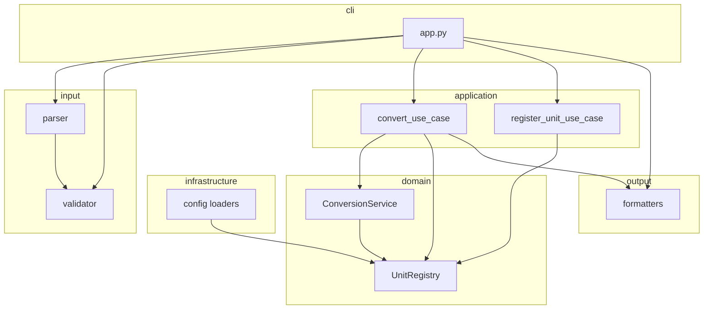

# Unit Converter — Specification Report

| 항목 | 내용 |
|------|------|
| 문서 번호 | 01 |
| 문서명 | UnitConverter Spec Report |
| 버전 | 0.2 |
| 작성일 | 2026-06-05 |
| 상태 | Draft |
| 관련 문서 | [docs/PRD.md](../docs/PRD.md), [README.md](../README.md) |

---

## 1. 문서 목적

본 문서는 Unit Converter 프로젝트의 **현행 레거시 코드 분석**, **PRD 대비 갭**, **SRP/OCP 위반 사항**, **입력 검증 누락**, **목표 아키텍처** 및 **FR/NFR 레이어 매핑**을 정리한 기술 명세 보고서이다. 구현 착수 전 설계 합의 및 Activity 1(문제 코드 분석) 산출물로 활용한다.

---

## 2. 현행 시스템 개요

### 2.1 산출물 현황

| 파일 | 설명 |
|------|------|
| `UnitConverter.py` | 37줄 단일 스크립트, 유일한 실행 코드 |
| `README.md` | 요구사항·실습 Activities 정의 (사실상 PRD 원본) |
| 테스트 / 설정 | **없음** |

### 2.2 실행 흐름 (As-Is)

```
input("unit:value")
  → ':' 존재 검사
  → split → float 변환
  → if/elif로 meter 환산
  → meter 기준 feet/yard 계산
  → print 3줄
```

### 2.3 As-Is 코드 요약

```python
# UnitConverter.py — 모든 책임이 main()에 집중
def main():
    input_str = input(...)
    # 파싱 · 검증 · 변환 · 출력 — 단일 함수
    if unit == "meter": ...
    elif unit == "feet": ...
    elif unit == "yard": ...
    print(...)
```

---

## 3. 레거시 코드 스멜 분석

### 3.1 구조·설계

| # | 코드 스멜 | 설명 | 해당 코드 |
|---|-----------|------|-----------|
| L-01 | **God Function** | `main()`이 I/O·파싱·검증·변환·출력 전담 | 전체 |
| L-02 | **OCP 위반** | 단위 추가 시 `elif`(16–24) + `print`(30–32) 동시 수정 | 16–32행 |
| L-03 | **SRP 위반** | 단일 함수에 6개 이상 변경 이유 | 전체 |
| L-04 | **Magic Number** | `3.28084`, `1.09361` 하드코딩 | 19–21, 27–28행 |
| L-05 | **중복 로직** | 입력→meter, meter→타단위가 별도 블록 | 16–28행 |
| L-06 | **Primitive Obsession** | Unit/ConversionResult 도메인 모델 부재 | 전체 |
| L-07 | **하드코딩 단위** | `"meter"`, `"feet"`, `"yard"` 분산 | 16–32행 |
| L-08 | **테스트 불가 구조** | `input()`/`print()`와 로직 결합 | 2, 30–32행 |

### 3.2 입력·출력

| # | 코드 스멜 | 설명 |
|---|-----------|------|
| L-09 | 불완전 검증 | README 명시 **음수** 검사 없음 |
| L-10 | 입력 정규화 부재 | `strip()` 없음 → `" meter"` 오류 |
| L-11 | 출력 포맷 고정 | JSON/CSV/표 미지원 |
| L-12 | 출력 정밀도 불일치 | README 예시(8.2, 2.7) vs full float 출력 |

### 3.3 확장성·운영

| # | 코드 스멜 | 설명 |
|---|-----------|------|
| L-13 | 설정 내부화 | 비율이 코드에 고정 |
| L-14 | 동적 등록 불가 | cubit 등 런타임 추가 불가 |
| L-15 | 테스트 부재 | TC 전무 |

---

## 4. PRD 갭 분석 (README / PRD 대비)

### 4.1 기능 요구 (FR)

| ID | 요구 | As-Is | 갭 |
|----|------|-------|-----|
| FR-01 | `단위:값` 파싱 | 부분 구현 | trim·빈 unit 미처리 |
| FR-02 | 전 단위 변환 출력 | 3단위 print | 구조적 확장 불가 |
| FR-03 | meter/feet/yard | 하드코딩 | ✅ 값은 동작 |
| FR-04 | meter 허브 변환 | 구현됨 | ✅ 로직 일치 |
| FR-05 | 확장 시 변경 최소 | elif 체인 | ❌ 미충족 |
| FR-06 | JSON/YAML 설정 | 없음 | ❌ 미구현 |
| FR-07 | 동적 단위 등록 | 없음 | ❌ 미구현 |
| FR-08 | 출력 포맷 선택 | print만 | ❌ 미구현 |
| FR-09 | 변환 TC | 없음 | ❌ 미구현 |
| FR-10 | 검증 TC | 없음 | ❌ 미구현 |

### 4.2 비기능 요구 (NFR)

| ID | 요구 | As-Is | 갭 |
|----|------|-------|-----|
| NFR-01 | OCP | 절차적 스크립트 | ❌ |
| NFR-02 | SRP | 단일 함수 | ❌ |
| NFR-03 | 음수 거부 | 없음 | ❌ |
| NFR-04 | 형식 거부 | `:`·float만 | ⚠️ 부분 |
| NFR-05 | unknown unit | 구현 | ✅ |
| NFR-06 | 테스트 용이성 | I/O 결합 | ❌ |

### 4.3 Activities 달성도

| Activity | 목표 | 현재 |
|----------|------|------|
| 1. 분석 | 구조 이해 | ✅ 본 Report |
| 2. 기본·품질 | OCP/SRP/검증 | ❌ 미착수 |
| 3. TC | 변환·검증 테스트 | ❌ 미착수 |
| 4. 추가 요구 | 설정/등록/포맷 | ❌ 미착수 |
| 5. 회고 | — | 구현 후 |

---

## 5. SRP 위반 상세 분석

### 5.1 `main()`에 묶인 책임

| 책임 | 코드 | 변경 유발 요인 |
|------|------|----------------|
| 사용자 I/O | 2, 30–32행 | 프롬pt, 출력 채널 |
| 입력 파싱 | 8행 | 입력 문법 |
| 형식·값 검증 | 4–6, 10–14, 22–24행 | 검증 정책 |
| 단위 식별 | 16–24행 | 지원 단위 목록 |
| 변환 계산 | 16–28행 | 비율·알고리즘 |
| 결과 포맷팅 | 30–32행 | JSON/CSV/표 |

**결론:** README가 요구하는 "SRP를 만족하는 클래스 구성"과 정반대 구조이다.

### 5.2 목표 SRP 분리

| 클래스/모듈 | 단일 책임 |
|-------------|-----------|
| `InputParser` | 문자열 → DTO |
| `InputValidator` | 형식·음수·단위 존재 검증 |
| `UnitRegistry` | 단위·비율 등록/조회 |
| `ConversionService` | meter 허브 변환 |
| `OutputFormatter` | 결과 → 문자열 |
| `ConvertUseCase` | 변환 유스케이스 조합 |
| `CliApp` | input/print만 |

---

## 6. 입력 검증 누락 상세

### 6.1 구현 현황

| 검증 항목 | README | As-Is |
|-----------|--------|-------|
| 콜론 없음 | ✅ | ✅ 4–6행 |
| 비숫자 value | ✅ | ✅ 10–14행 |
| unknown unit | ✅ | ✅ 22–24행 |
| **음수** | ✅ | ❌ **누락** |
| 빈 unit (`:2.5`) | (형식) | ⚠️ Unknown unit으로 처리 |
| 공백 trim | (암묵) | ❌ |
| 등록 문법 | FR-07 | ❌ |

### 6.2 음수 케이스

`meter:-2.5` → `float()` 성공 → 음수 결과 출력. **NFR-03 위반.**

### 6.3 형식 케이스 매트릭스

| 입력 | As-Is 동작 | 기대 (To-Be) |
|------|------------|--------------|
| `meter:2.5` | 정상 | 정상 |
| `:2.5` | Unknown unit | ERR_FORMAT (빈 unit) |
| ` meter:2.5 ` | Unknown unit (공백) | trim 후 정상 |
| `meter:` | Invalid number | ERR_FORMAT 또는 ERR_NUMBER |
| `meter:-1` | 변환 출력 | ERR_NEGATIVE |

---

## 7. OCP 위반 및 목표 설계

### 7.1 As-Is OCP 문제

단위 `inch` 추가 시:

1. `elif unit == "inch"` 추가 (입력 분기)
2. `in_inches = ...` 계산 추가
3. `print(... inch)` 추가

→ **변환 코어·CLI·출력** 세 곳 수정 = OCP 위반.

### 7.2 To-Be OCP 확장 포인트

| 확장 대상 | 방법 | 수정 금지 영역 |
|-----------|------|----------------|
| 새 단위 | `units.json` 또는 `Registry.register()` | `ConversionService` |
| 새 출력 포맷 | `XxxFormatter` 클래스 추가 | Converter |
| 새 설정 형식 | `YamlConfigLoader` 추가 | domain |
| 새 입력 문법 | Parser 구현 추가 | Converter |

### 7.3 Protocol / 인터페이스 (초안)

```python
# output/formatter.py
class OutputFormatter(Protocol):
    def format(self, results: list[ConversionResult]) -> str: ...

# infrastructure/config/loader.py
class ConfigLoader(Protocol):
    def load(self, path: str) -> UnitRegistry: ...
```

---

## 8. 목표 패키지 구조 (To-Be)

**물리 경로 SSOT:** [docs/PRD.md](../docs/PRD.md) §6.1 — `src/{entity, control, boundary}`  
아래는 **논리 레이어** 관점의 모듈 배치이다.

```
src/
├── entity/                    # domain
│   ├── models.py              # Unit, ConversionRequest, ConversionResult
│   ├── registry.py            # UnitRegistry (from_meter_factor, BR-05)
│   ├── converter.py           # ConversionService
│   └── exceptions.py
│
├── control/                   # application
│   ├── convert_use_case.py
│   └── register_unit_use_case.py
│
└── boundary/
    ├── input/
    │   ├── parser.py
    │   └── validator.py
    ├── output/
    │   ├── formatter.py       # Protocol
    │   ├── table_formatter.py
    │   ├── json_formatter.py
    │   └── csv_formatter.py
    ├── infrastructure/
    │   └── config/
    │       ├── loader.py
    │       ├── json_loader.py
    │       └── yaml_loader.py
    └── cli/
        └── app.py

config/units.json              # from_meter_factor (1 m = N unit)
tests/entity/, tests/control/, tests/boundary/, tests/integration/
UnitConverter.py               # legacy; 최종 boundary/cli 위임
```

### 8.1 논리 레이어 ↔ ECB 매핑

| 논리 | ECB | 경로 |
|------|-----|------|
| domain | Entity | `src/entity/` |
| application | Control | `src/control/` |
| input / output / infrastructure / cli | Boundary | `src/boundary/*/` |

### 8.2 의존성 규칙 (NFR-07)

```
boundary → control → entity
entity   → (외부 import 없음)
```

---

## 9. FR/NFR 레이어 매핑

### 9.1 매핑 테이블

| 레이어 | 담당 FR | 담당 NFR |
|--------|---------|----------|
| **domain** | FR-03, FR-04, FR-05, FR-07 | NFR-01, NFR-02 |
| **input** | FR-01, FR-07(문법) | NFR-02, NFR-03, NFR-04, NFR-05 |
| **application** | FR-02, FR-07(흐름) | NFR-06 |
| **infrastructure** | FR-06 | NFR-01 |
| **output** | FR-08 | NFR-01, NFR-02 |
| **cli** | FR-01, FR-02, FR-08 (UX) | NFR-02, NFR-06 |
| **tests** | FR-09, FR-10 | NFR-01~07 |

### 9.2 핵심 클래스 책임

#### domain/converter.py

```python
class ConversionService:
    def convert_all(self, value: float, from_unit: str) -> list[ConversionResult]:
        base = self._registry.to_base(value, from_unit)
        return [
            ConversionResult(from_unit, value, target, self._registry.from_base(base, target))
            for target in self._registry.all_units()
        ]
```

- FR-04: meter 허브
- FR-05: 단위 목록은 Registry 순회 — converter 코드 불변

#### input/validator.py

- NFR-03: `value < 0`
- NFR-04: 빈 unit, 콜론, trim
- NFR-05: `registry.has(unit)`

#### output/table_formatter.py

- FR-08, BR-07: `2.5 meter = 8.2 feet` (1자리 반올림)

---

## 10. 아키텍처 다이어그램



---

## 11. OCP/SRP 검증 시나리오

| 시나리오 | Converter 수정 | Registry/Config | Formatter |
|----------|----------------|-----------------|-----------|
| inch 추가 | ❌ 불필요 | ✅ JSON/register | ❌ |
| XML 출력 추가 | ❌ | ❌ | ✅ XmlFormatter |
| YAML 설정 | ❌ | ✅ YamlLoader | ❌ |
| cubit 등록 | ❌ | ✅ register | ❌ |
| 음수 검증 강화 | ❌ | ❌ | ❌ (Validator만) |

---

## 12. 구현 로드맵 (권장 순서)

| Phase | 작업 | FR/NFR |
|-------|------|--------|
| **P0** | domain (models, registry, converter, exceptions) | FR-03~05, NFR-01~02 |
| **P0** | input (parser, validator) | FR-01, NFR-03~05 |
| **P0** | application + cli (table 출력) | FR-02, NFR-06 |
| **P0** | tests/unit (converter, validator) | FR-09, FR-10 |
| **P1** | infrastructure (JSON/YAML loader) | FR-06 |
| **P1** | register use case + parser | FR-07 |
| **P1** | json/csv formatters | FR-08 |
| **P1** | tests/integration | FR-06~08 |

---

## 13. 리스크 및 미결정 사항

| 항목 | 설명 | 권장 |
|------|------|------|
| R-01 | JSON vs YAML 기본 설정 | JSON 기본, YAML 선택 |
| R-02 | 등록 입력과 변환 입력 구분 | 프롬프트 모드 또는 `register:` 접두 |
| R-03 | 0 허용 여부 | 허용 (`value >= 0`) |
| R-04 | JSON 출력 소수 자릿수 | domain full precision, formatter에서 반올림 |
| R-05 | `UnitConverter.py` 유지 | `boundary/cli` 위임으로 하위 호환 |
| R-06 | Registry 비율 정의 | **해결** — `from_meter_factor` (PRD BR-05, §7.3). JSON·레거시·BR-02/03 일치 |

---

## 14. 결론

현행 `UnitConverter.py`는 **3단위 변환 PoC** 수준이며, README/PRD가 요구하는 **OCP·SRP·입력 검증·설정 외부화·동적 등록·출력 포맷·테스트**는 대부분 미구현이다. 본 Report에서 제안한 **레이어드 패키지 구조**와 **FR/NFR 매핑**을 따르면 Activity 2~4를 단계적으로 완료할 수 있다.

**다음 단계:** Phase P0 domain/input/application 구현 착수 → [docs/PRD.md](../docs/PRD.md) §10 체크리스트 추적.

---

## 15. 변경 이력

| 버전 | 일자 | 변경 내용 |
|------|------|-----------|
| 0.1 | 2026-06-05 | 초안 — 레거시 분석·설계 논의 종합 |
| 0.2 | 2026-06-05 | ECB 물리 경로·from_meter_factor SSOT 반영 (PRD §6.1·§7.3 동기화) |
